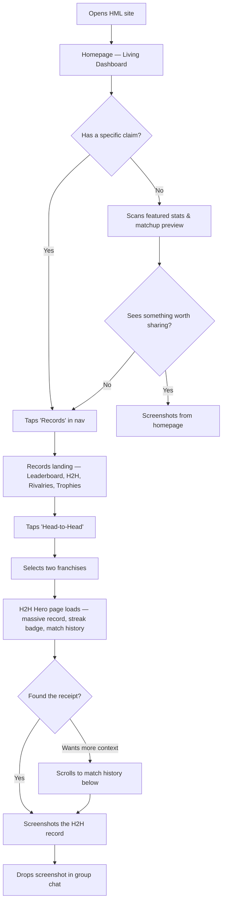
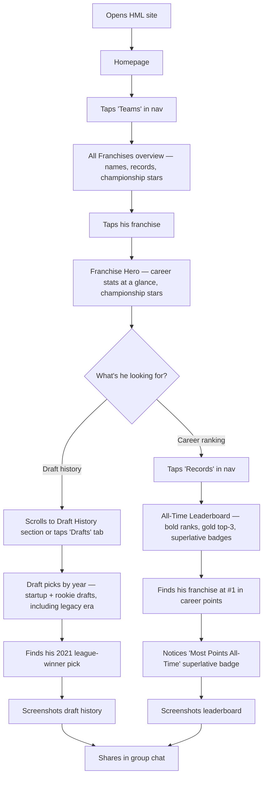
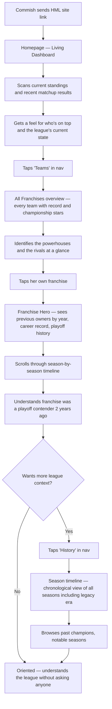
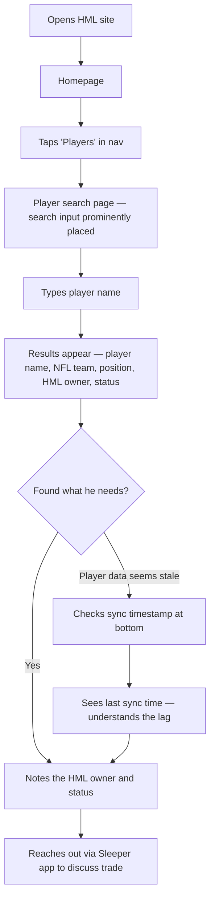

# UX Design Specification FantasyWebsite

**Author:** Blake
**Date:** 2026-03-17

---

<!-- UX design content will be appended sequentially through collaborative workflow steps -->

## Executive Summary

### Project Vision

The Harambe Memorial League Memorial League Website transforms a 12-team dynasty fantasy football league from scattered Sleeper app data and group chat memories into a permanent, always-available institution with history, personality, and trash-talk fuel. The site is fully public (no login), server-rendered, and mobile-first — designed for quick weekly check-ins and deep historical dives alike. All data is automatically synced from the Sleeper API, with near-live matchup scores during NFL game windows. The site preserves and unifies history across the league's legacy 10-team era and current 12-team format.

### Target Users

1. **The Casual Member** — Visits weekly on mobile, wants rivalry stats and trash-talk ammunition fast. Values glanceable, shareable content.
2. **The Stats Nerd** — Deep-dives into draft history, career legacy stats, and all-time leaderboards. Wants proof and receipts across all seasons including the legacy era.
3. **The Commish** — Manages the league record. Will publish weekly recaps in Phase 2. Needs the site to be the authoritative source of truth.
4. **The New Manager** — Just joined, needs to get oriented on their franchise's history, the league landscape, and who the competition is — without asking anyone.
5. **The Dynasty Manager** — Checks player ownership and status for trade intel. Quick in-and-out visits, often on mobile.

### Key Design Challenges

1. **Data-dense tables on mobile** — Standings, leaderboards, draft boards, and head-to-head records are inherently tabular. The UX must make these scannable on phones without relying on constant horizontal scrolling.
2. **Legacy/current era continuity** — The site spans two league eras (10-team → 12-team). Franchise history, draft records, and career stats must flow seamlessly across eras without confusing the user about which era they're viewing.
3. **Live vs. static content blending** — The matchup page introduces near-live polling into an otherwise static, server-rendered site. The experience must feel cohesive, not like two different products.
4. **Color-blind accessibility** — A league member cannot distinguish reds and purples. All color-coded UI (win/loss, rankings, status) must include secondary indicators (labels, icons, patterns). Red/purple pairings are prohibited as primary data signals.

### Design Opportunities

1. **Trash-talk fuel by design** — Shareable URLs, screenshot-friendly layouts, and provocative stat surfacing (rivalry streaks, head-to-head dominance) drive organic engagement through group chat sharing.
2. **Franchise identity as anchor** — Persistent franchise pages with year-over-year ownership, trophies, and records create institutional weight that no fantasy platform provides natively.
3. **Glanceable surface, explorable depth** — Most visits are quick (check scores, grab a stat). The same data should reward deeper exploration. A progressive-depth pattern serves all five user types without overwhelming casual visitors or boring power users.

## Core User Experience

### Defining Experience

The HML Website serves two complementary core loops driven by the NFL calendar:

- **In-season (Sep–Jan):** Arrive → find a stat, rivalry record, or matchup result → screenshot → fire it into the group chat. The site is a trash-talk weapon. Speed-to-stat is everything.
- **Offseason (Feb–Aug):** Browse franchise histories, draft records, and career stats with a sense of nostalgia and institutional pride. The site is a living archive that rewards leisurely exploration of "remember when" moments.

The core user action across both modes is the same: **find a specific historical fact and either share it or savor it.** Every design decision should minimize the distance between "I wonder..." and "here it is."

### Platform Strategy

- **Mobile-first web application** — the majority of visits will be phone-based (checking scores at lunch, screenshotting stats for group chat sharing, quick player lookups)
- **Desktop as secondary but valued** — deep dives into draft history, full season timelines, and multi-franchise comparisons are better on larger screens
- **No native app, no offline** — a responsive web app with shareable URLs is the right tool for a 12-person audience
- **Touch-optimized** — tap targets, swipeable content where appropriate, no hover-dependent interactions

### Effortless Interactions

- **Viewing history and matchup results** — browsing any season's results, any franchise's record, any week's matchups must feel instant and require minimal navigation
- **Finding superlatives** — "who's the best/worst franchise in league history?" should be answerable at a glance from leaderboards and career stats
- **Sharing** — every meaningful view has a clean, shareable URL; layouts should look good when screenshotted on mobile
- **Orientation** — a new manager landing on the site should understand the league landscape without guidance; the information architecture should be self-explanatory

### Critical Success Moments

1. **The superlative discovery** — a member visits, finds proof that a franchise is definitively the best or worst at something historically, and shares it. This is the moment the site becomes indispensable.
2. **The rivalry receipt** — pulling up an H2H record that settles a group chat argument. The site becomes the authoritative source.
3. **The nostalgia scroll** — browsing old seasons and draft picks during the offseason, remembering trades and busts. The site becomes the league's collective memory.
4. **The new manager "aha"** — a new owner explores their franchise page and understands its full history without asking anyone. The site earns trust.

### Experience Principles

1. **Speed-to-stat** — every design choice should minimize the number of taps/clicks between a question and its answer. If a user has to think about where to find something, we've failed.
2. **Superlatives on the surface** — best, worst, most, least, longest streak — these should be visible and prominent, not buried in raw data tables. The site should tell stories, not just display numbers.
3. **Screenshot-worthy** — layouts should be designed with the assumption that they'll be screenshotted and dropped into a group chat. Clean, legible, with enough context to stand alone.
4. **Two modes, one site** — the same content serves both in-season trash talk and offseason nostalgia. The design should feel energetic during game windows (live scores) and warm/archival when browsing history.

## Desired Emotional Response

### Primary Emotional Goals

1. **Competitive Pride** — The site should make every franchise owner feel like their history matters. Seeing your record, your draft picks, your rivalry wins laid out on a polished stage creates a sense of "this is MY franchise." The data becomes proof of legacy, not just numbers.

2. **Connection** — Users should feel like they're part of something bigger than any single season. The site transforms a group chat league into an institution with history, traditions, and a shared story that spans years. Browsing old seasons should feel like flipping through a yearbook you're in.

3. **Delight Through Discovery** — The site should reward exploration with small "that's sick" moments — a visual treatment that makes a stat pop, a callout that surfaces something you didn't know, a layout that makes a record feel weighty. These moments are what pull users back and make them choose this over the Sleeper app.

### Emotional Journey Mapping

| Stage | Desired Emotion | Design Implication |
|---|---|---|
| **First visit** | "This is legit" — impressed by the polish and personality | Clean, modern visual design with enough flair to signal this isn't a generic stats page |
| **Finding a stat** | "Oh damn, look at that" — satisfying discovery | Bold visual treatments for records, streaks, and superlatives that make data feel like a reveal |
| **Sharing to group chat** | "They need to see this" — urgency to share | Screenshot-friendly layouts with enough context to stand alone; shareable URLs |
| **Browsing history** | "Remember when..." — warm nostalgia mixed with competitive pride | Season timelines and franchise histories that feel like a chronicle, not a spreadsheet |
| **Returning** | "Let me check..." — habitual pull | Fresh data (live scores, updated rankings) and enough depth that there's always something new to find |
| **Seeing a bad record** | Wry amusement, not embarrassment | The site presents facts without editorializing — the group chat does the roasting |

### Micro-Emotions

- **Confidence over confusion** — navigation and information hierarchy should feel obvious; users never wonder "where do I find that?"
- **Delight over mere satisfaction** — small visual moments (a trophy icon, a streak badge, a bold stat highlight) elevate the experience from functional to memorable
- **Competitive fire over passive browsing** — the data should provoke reactions ("I didn't know I had the longest win streak against them")
- **Belonging over isolation** — even a new manager browsing the site should feel like they've joined something with weight and history

### Design Implications

| Emotional Goal | UX Approach |
|---|---|
| "That's sick" moments | Bold typography for superlatives and records; visual accents (badges, icons, subtle animations) for achievements and streaks; trophy displays that feel premium |
| Cool stage, not a toy | Clean, modern layout with generous whitespace; professional typography hierarchy; personality comes through content and selective visual moments, not gimmicks |
| Competitive pride | Franchise pages that feel like a team homepage; head-to-head records presented with visual weight; leaderboards that make position feel significant |
| Connection to history | Season timelines with narrative flow; legacy era data treated with the same visual care as current seasons; franchise identity that persists and accumulates meaning |
| Choose this over Sleeper | Faster path to the stat you want; richer context around data (streaks, records, comparisons); visual presentation that makes the same data feel more meaningful |

### Emotional Design Principles

1. **The Cool Stage Rule** — The site is a premium stage for league content, not a character in the league itself. Professional and clean first, personality second. Think sports brand, not meme page.
2. **Earned Moments of Flair** — Visual delight is reserved for data that deserves it — records, streaks, championships, superlatives. Not everything gets the treatment; the restraint is what makes the moments land.
3. **Facts, Not Editorials** — The site presents data with visual weight and lets the numbers speak. It doesn't tell you who's bad — it shows you the receipts and lets the group chat handle the rest.
4. **Tidbits Over Trophies** — Small, discoverable proof points (a streak callout, a "best in league history" label, a head-to-head stat) are more powerful than big flashy displays. Bragging rights are earned through data, not decoration.
5. **Worth the Visit** — Every design choice should pass the test: "Would a league member open this instead of the Sleeper app?" If the answer is no, it needs more personality, better presentation, or faster access.

## UX Pattern Analysis & Inspiration

### Inspiring Products Analysis

**ESPN (Sports Data Reference)**
- **What it does well:** Comprehensive sports data coverage with clear information hierarchy; game-day experience feels urgent and alive; strong brand identity that makes sports data feel important
- **What to learn from it:** How to present scores, standings, and stats in a way that feels authoritative — not just a data dump but a sports destination with editorial weight
- **Limitation to avoid:** Dense, ad-cluttered layouts that prioritize content volume over readability; ESPN packs everything onto every page

**Sports Betting Sites (DraftKings, FanDuel, etc.)**
- **What they do well:** Make numbers feel urgent and exciting; bold typography on odds and lines; live-updating data feels dynamic; color-coded movement indicators (up/down arrows, green/red shifts) create energy even on static screens
- **What to learn from them:** How to make data feel alive and high-stakes — even small numbers feel important when presented with visual weight and motion cues
- **Limitation to avoid:** Visual overload; too many competing CTAs; gambling-specific UI patterns (flashing, pulsing) that feel cheap rather than premium

**Apple (Premium Product UX)**
- **What it does well:** Generous whitespace that makes content feel important; scroll-triggered animations that reveal content with purpose and rhythm; minimal navigation that stays out of the way; every element earns its place on screen
- **What to learn from it:** Restraint as a design tool — showing less but presenting it with conviction creates a more memorable experience than showing everything at once
- **Key UX pattern:** Progressive disclosure through scrolling — information unfolds as you move through the page rather than hitting you all at once

**Grovemade / Ready (Premium Brand Sites)**
- **What they do well:** Clean, editorial layouts where the product is the hero; typography and spacing do the heavy lifting; animations are smooth and purposeful, never gratuitous; the experience feels curated, not generated
- **What to learn from them:** How to make a content-driven site feel like a designed experience rather than a database frontend; visual rhythm through alternating layouts, bold type, and intentional pacing
- **Key UX pattern:** Content sections that breathe — each block has a clear purpose, clear hierarchy, and room to land before the next one begins

### Transferable UX Patterns

**Navigation Patterns:**
- **Minimal persistent nav** (Apple/Grovemade) — a clean top bar with core sections; the content is the experience, not the chrome. Works for HML because there are only ~6 top-level sections
- **Contextual sub-navigation** (ESPN) — within a section like a franchise page, use tabs or anchors to move between sub-views (history, roster, drafts) without leaving the page

**Interaction Patterns:**
- **Scroll-triggered reveals** (Apple/Ready) — sections animate into view as you scroll, creating rhythm and pacing. Franchise pages, season timelines, and draft histories become experiences you move through, not tables you scan
- **Live data energy** (Betting sites) — during game windows, matchup scores should feel alive with subtle motion cues (score updates, status indicators) that create urgency without overwhelming
- **Progressive depth** (Apple) — surface the headline stat or story first, let users drill into detail on demand. A franchise page leads with the record and trophies, not a 20-column table

**Visual Patterns:**
- **Bold typography as the hero** (Grovemade/Ready) — large, confident type for key stats, records, and superlatives. The numbers themselves become visual moments. A "7-2 all-time" head-to-head record should hit you visually before you read the context
- **Generous whitespace** (Apple) — give data room to breathe. One powerful stat with space around it is more impactful than ten stats crammed together
- **Purposeful color accents** (Betting sites, adapted) — use color sparingly to highlight wins, streaks, championships, and live scores. The restraint makes the color moments land harder

### Anti-Patterns to Avoid

- **The ESPN trap** — cramming every possible stat onto one page because the data exists. More data ≠ better experience. Show what matters, link to the rest
- **The spreadsheet default** — presenting a full-width table as the primary content on a page. Tables are a tool, not a layout. Use them when they're the right format, but wrap them in context and visual hierarchy
- **Gratuitous animation** — animation that exists to show off rather than to guide attention or create rhythm. Every animation should either reveal content, indicate state, or create pacing
- **Tiny text on mobile** — most sports sites shrink data tables to fit on phones, making them unreadable. Better to show fewer columns with readable type and let users access detail on tap
- **Generic sports template look** — dark backgrounds with neon accents, aggressive gradients, and stock-photo headers. The HML site should feel like a premium brand, not a fantasy sports template

### Design Inspiration Strategy

**What to Adopt:**
- Apple/Grovemade's whitespace philosophy — every element earns its space; data breathes
- Scroll-triggered content reveals for narrative pages (franchise history, season timelines, draft history)
- Bold typography as the primary visual tool for making stats feel important
- Minimal, clean navigation that lets content be the experience

**What to Adapt:**
- Betting sites' data energy — adapt the "numbers feel alive" approach for live matchup scores, but dial back the intensity to match the premium feel. Subtle motion, not flashing
- ESPN's information hierarchy for standings and leaderboards — clear rank/position emphasis, but with far more whitespace and fewer competing elements per view
- Progressive disclosure pattern — lead with the story (headline stat, record, streak), offer the detail (full table, historical breakdown) one tap deeper

**What to Avoid:**
- ESPN's density and ad-driven layout priorities
- Generic dark-mode sports template aesthetics
- Animation for animation's sake
- Showing all data at once instead of curating what matters most per view
- Horizontal scroll tables as a primary mobile pattern — prefer card layouts or focused column views

**The Zig:** While every fantasy and sports stats site zags toward maximum data density, the HML site zigs toward **curated, premium presentation** — fewer things per screen, each presented with conviction. The site should feel closer to a sports brand's homepage than a stats database. This is the single biggest differentiator and the reason league members will choose it over the Sleeper app.

## Design System Foundation

### Design System Choice

**Custom Visual Layer on Accessible Foundation** — Radix UI (via shadcn/ui) provides the interactive behavior layer (tabs, dialogs, tooltips, dropdowns), while the entire visual presentation is built custom with Tailwind CSS v4. This gives the HML site a fully owned visual identity that can be iterated on freely, without inheriting or overriding third-party design opinions.

### Rationale for Selection

| Factor | Decision Driver |
|---|---|
| **Visual uniqueness** | The "zig" strategy demands a premium aesthetic that no off-the-shelf component library provides. Custom visual design is the only way to achieve the Apple/Grovemade-inspired presentation |
| **Iteration velocity** | A custom visual layer is additive — every change builds on your own design language. Extended components require overriding defaults, which creates friction as the design evolves |
| **Accessibility** | Radix UI handles the hard accessibility problems (focus management, keyboard navigation, ARIA attributes, screen reader support) so custom styling doesn't sacrifice usability |
| **Architecture alignment** | The architecture specifies shadcn/ui primitives — this approach uses them exactly as intended: copy the component, own the code, style it however you want |
| **Long-term ownership** | No dependency on a component library's design direction. The visual system is entirely project-owned and can evolve season over season |

### Implementation Approach

**Behavioral Layer (Radix UI / shadcn/ui):**
- Use shadcn/ui's `init` to scaffold the project with Radix UI primitives
- Only add components as needed (table, tabs, dialog, tooltip, dropdown-menu, badge, card)
- Strip default styling to bare accessibility and behavior
- These components handle: focus traps, keyboard navigation, ARIA roles, open/close state, portal rendering

**Visual Layer (Tailwind CSS v4 — fully custom):**
- All visual styling built directly with Tailwind utilities and custom theme configuration
- Typography scale, color palette, spacing rhythm, and visual treatments are project-owned
- No shadcn/ui default theme colors or design tokens retained — everything redefined to match the HML brand
- Scroll-triggered animations via CSS and minimal JS (Intersection Observer), not a third-party animation library

**Component Architecture:**
- Shared UI primitives in `components/ui/` — Radix behavior + custom Tailwind styling
- Route-specific components colocated in their `app/` route folder — fully custom visual presentations
- "Moment" components (stat highlights, streak badges, trophy displays) built entirely custom — these are the "that's sick" elements and should have zero library DNA

### Customization Strategy

**Design Tokens (Tailwind theme config):**
- Custom color palette (defined in Step 7+) — no shadcn/ui default colors
- Custom typography scale optimized for bold stat presentation and clean body text
- Custom spacing scale with generous whitespace built into the rhythm
- Responsive breakpoints tuned for mobile-first sports data consumption

**Custom Component Categories:**

| Category | Examples | Approach |
|---|---|---|
| **Data display** | Standings table, leaderboard, draft board, H2H record | Radix Table behavior + fully custom visual treatment with bold type, whitespace, and rank emphasis |
| **Navigation** | Site nav, season selector, franchise tabs | Radix primitives for behavior + custom minimal chrome styling |
| **Moment components** | Stat highlight cards, streak badges, trophy displays, superlative callouts | 100% custom — no library components. These carry the design personality |
| **Live elements** | Score poller, update indicators | Custom with subtle motion (CSS transitions/animations) for the betting-site-inspired data energy |
| **Layout** | Section containers, scroll-triggered reveals, card grids | Pure Tailwind + Intersection Observer. No layout library |

**Animation Strategy:**
- CSS transitions and keyframe animations for micro-interactions (hover states, score updates, badge reveals)
- Intersection Observer for scroll-triggered section reveals — lightweight, no animation library dependency
- Motion is purposeful and restrained: reveal content, indicate state change, create pacing. Never decorative
- Respect `prefers-reduced-motion` media query for accessibility

**Iteration Model:**
- Every visual component is project-owned Tailwind — changes are direct edits, not theme overrides
- New "moment" components can be added per season or feature without touching the foundation
- The design system grows additively: new tokens, new components, new visual treatments — never fighting existing library opinions

## Defining Core Experience

### The Defining Interaction

**"Go to our league's hub, find the receipt, screenshot it."**

The HML Website's defining experience is the moment a league member arrives with a claim — "I've beaten you more than you've beaten me," "my draft history is better than yours," "I've scored more all-time points" — and in seconds has the visual proof on their screen, ready to screenshot and drop into the group chat.

If this single loop feels fast, satisfying, and looks good enough to share, the entire site succeeds. Every other feature (live scores, draft history, season timelines) is valuable, but this is the interaction that makes the site indispensable.

**The one-sentence description a member gives a friend:**
*"It's our league's site — it has everything, and you can look up any stat or record from any season."*

### User Mental Model

**Current behavior:** League members already know their history — who they've beaten, which drafts were great, where they rank. The knowledge lives in their heads, in group chat arguments, and in scattered Sleeper app data. When a debate starts, they either argue from memory (unreliable), scroll through old Sleeper data (slow and painful), or dig through group chat history (nearly impossible). Most of the time, claims go unverified. The argument dies without resolution.

**The gap the site fills:** The HML site replaces "I'm pretty sure" with "here, look." The mental model isn't learning a new tool — it's going to a place they already trust to get proof of something they already believe. The site doesn't change how league members think about their league; it gives them a faster, better way to access what they already care about.

**Key mental model insight:** Users arrive with intent. They're not browsing aimlessly — they have a specific claim, question, or curiosity. The site's job is to get out of the way and deliver the answer. But the homepage should also *give* them something to react to when they don't arrive with a specific question — a living dashboard that surfaces content worth sharing.

### Success Criteria

| Criteria | Measure |
|---|---|
| **Speed-to-proof** | A member can find any historical stat, record, or matchup result within 2-3 taps from the homepage |
| **Screenshot-ready** | The layout of any stat, record, or leaderboard looks clean and legible when screenshotted on a phone — no cropping or explanation needed |
| **Hub gravity** | The homepage feels alive — current standings, recent results, a featured stat or superlative — so members have a reason to visit even without a specific question |
| **Argument settler** | A head-to-head record, all-time leaderboard position, or franchise stat is visually definitive enough to end a group chat debate |
| **Return pull** | Members develop a habit of checking the site weekly during the season — not because they have to, but because there's always something new on the dashboard |

### Novel UX Patterns

**Pattern approach: Established patterns, premium execution.**

The HML site doesn't need to invent new interaction patterns. The core actions — browsing standings, checking records, looking up stats — are well-understood. What's novel is the *presentation quality* applied to fantasy league data. No one has given a 12-person dynasty league the Apple/Grovemade visual treatment before.

**Established patterns we adopt:**
- Dashboard homepage with live/recent data (ESPN, any sports app)
- Tabbed franchise pages with sub-sections (standard sports team pages)
- Leaderboard/standings tables with rank emphasis (universal sports pattern)
- Search for player lookup (standard)

**Our unique twist on established patterns:**
- **Curated density** — where every sports site shows maximum data, we show fewer things with more visual weight. A leaderboard isn't 15 columns; it's 4 columns with bold rank numbers and generous spacing
- **"That's sick" moments** — stat highlights, streak badges, and superlative callouts that make data feel like a discovery, not a lookup. These don't exist on Sleeper or ESPN for a private league
- **Scroll-as-narrative** — franchise pages and season histories unfold as you scroll, using the Apple-inspired reveal pattern to create pacing instead of dumping everything into one view
- **Screenshot-first layout** — every data view is designed with the assumption that it will be screenshotted at mobile width and shared without context. This isn't an afterthought; it's a primary design constraint

### Experience Mechanics

**1. Initiation — Arriving at the Hub**
- Member opens the site (likely from a bookmarked link or group chat link)
- Homepage greets them with a living dashboard: current season standings, this week's matchups/results, and a rotating featured stat or superlative ("Longest active win streak: Team X — 5 games")
- The dashboard gives them something to react to immediately, even without a specific question
- Navigation is minimal and obvious — the 5-6 core sections are visible without a menu tap

**2. Interaction — Finding the Receipt**
- Member taps into the relevant section (records, franchise page, leaderboard, head-to-head)
- Content loads server-rendered and complete — no spinners, no skeleton states for static data
- The headline stat or record is visually prominent (bold type, whitespace, visual weight)
- Supporting detail is available below or one tap deeper (full table, historical breakdown)
- For head-to-head lookups: select two franchises → see the all-time record with visual emphasis on who leads

**3. Feedback — The "Got It" Moment**
- The stat they were looking for is immediately visible and visually definitive
- Bold typography and layout make the answer feel authoritative — not buried in a row of a table, but presented as a statement
- Visual accents (streak badges, rank indicators, superlative labels) add context that makes the stat more shareable
- The URL updates cleanly so they could share a link if they wanted — but the screenshot is the primary share action

**4. Completion — The Screenshot and Share**
- The member screenshots the stat on their phone
- The layout is designed so the screenshot captures the key information with enough context to stand alone: the stat, the franchises involved, the visual treatment
- They drop it in the group chat. The conversation starts.
- The site's job is done — until the next argument

## Visual Design Foundation

### Color System

**Primary Theme: "Press Box" — Warm, Institutional, Premium**

| Role | Color | Usage |
|---|---|---|
| **Background** | Warm off-white / cream (`#FAF8F5` range) | Page background, content areas — warmth without yellowness |
| **Surface** | Soft warm white (`#FFFFFF` or `#FEFCF9`) | Cards, elevated containers, table rows |
| **Text — Primary** | Rich dark charcoal (`#1A1A1A` range) | Headlines, stat numbers, primary content |
| **Text — Secondary** | Warm medium gray (`#6B6560` range) | Labels, supporting text, metadata |
| **Text — Tertiary** | Light warm gray (`#9C9590` range) | Timestamps, subtle annotations |
| **Brand Accent** | Forest green (`#2D5A3D` range) | Navigation highlights, links, interactive elements, section emphasis |
| **Achievement** | Warm antique gold (`#B8860B` range) | Trophies, championships, superlative badges, earned-moment accents |
| **Border / Divider** | Warm light gray (`#E8E4E0` range) | Table borders, section dividers, card edges |

**Semantic Color Mapping:**

| Semantic Role | Approach |
|---|---|
| **Wins** | **Bold type weight + "W" label** — no dedicated win color. Forest green may subtly reinforce in backgrounds, but typography and labels are the primary signal |
| **Losses** | **Regular/light type weight + "L" label** — muted presentation, not highlighted |
| **Streaks / Records** | Gold accent for positive superlatives; bold type for all record callouts |
| **Live / Active** | Forest green dot or subtle pulse for live game indicators |
| **Era indicator** | Subtle warm tint or label to distinguish legacy (10-team) vs. current (12-team) data |

**Accessibility Compliance:**
- All text meets WCAG 2.1 AA contrast ratios against warm backgrounds (minimum 4.5:1 for body, 3:1 for large text)
- No information conveyed by color alone — every color signal has a text label, icon, or typographic treatment as primary indicator
- No red/purple pairings anywhere in the palette
- Forest green tested against warm backgrounds for sufficient contrast
- Gold tested for legibility as accent (used on badges/labels, not body text)

**Documented Alternative: "Clean Slate"**

Available as a swap if the warm direction doesn't feel right in implementation:

| Role | Color |
|---|---|
| **Background** | Crisp white (`#FFFFFF`) |
| **Surface** | Off-white (`#FAFAFA`) |
| **Text — Primary** | Dark charcoal (`#111111`) |
| **Brand Accent** | Rich emerald or deep blue (TBD at swap time) |
| **Achievement** | Gold (carried over) |
| **Win/Loss** | Same typographic approach — no change needed |

The swap is a theme-level change (Tailwind config + CSS variables), not a structural redesign. Typography, spacing, and component architecture remain identical.

### Typography System

**Primary Typeface: Geist Sans**
- Vercel's own geometric sans-serif — free, open source, optimized for Next.js
- Excellent legibility at all sizes; clean geometric forms with subtle humanist warmth
- Ships with `next/font` for zero-layout-shift loading
- Weights used: Regular (400), Medium (500), Bold (700), Black (900)

**Why Geist:** It's modern and geometric (primary goal), has enough warmth to avoid feeling sterile (pairs with the Press Box theme), and is technically free with zero-config Next.js integration. No font-loading complexity.

**Secondary Typeface: None (single-family system)**
- All hierarchy created through size, weight, and spacing
- Simpler, more Apple-like approach
- Keeps the design system lean and consistent
- If editorial accent is ever desired (league name, section titles), a serif like Newsreader can be introduced later without disrupting the system

**Type Scale:**

| Token | Size | Weight | Usage |
|---|---|---|---|
| **Display** | 48–64px | Black (900) | Hero stats, defining numbers ("7-2 all-time"), homepage headline |
| **H1** | 36–40px | Bold (700) | Page titles ("Franchise: Team Name", "All-Time Leaderboard") |
| **H2** | 28–32px | Bold (700) | Section headers within pages |
| **H3** | 20–24px | Medium (500) | Subsection headers, card titles |
| **Body Large** | 18px | Regular (400) | Featured descriptions, stat context |
| **Body** | 16px | Regular (400) | Standard body text, table cells |
| **Body Small** | 14px | Regular (400) | Secondary labels, metadata, timestamps |
| **Caption** | 12px | Medium (500) | Badges, tags, micro-labels ("LEGACY ERA", "CAREER HIGH") |

**Stat Presentation Typography:**
- Key stats (win-loss records, points scored, rankings) use **Display or H1 weight** — the number itself is the visual moment
- Supporting context (season, opponent, date) uses Body or Body Small — subordinate to the stat
- Superlative labels ("Best in League History", "Active Streak") use Caption weight in uppercase with tracking — small but visible badge treatment

**Responsive Scaling:**
- Display and H1 scale down ~20-30% on mobile (e.g., Display: 48px → 36px)
- Body sizes remain constant across breakpoints for readability
- Minimum touch target text: 16px (no interactive text smaller than Body)

### Spacing & Layout Foundation

**Base Unit: 8px**
- All spacing derived from 8px multiples: 8, 16, 24, 32, 48, 64, 96, 128
- Consistent rhythm across all components and pages
- Generous by default — Apple-level breathing room

**Spacing Scale:**

| Token | Value | Usage |
|---|---|---|
| **xs** | 8px | Tight internal padding (badge padding, inline spacing) |
| **sm** | 16px | Standard internal padding (card padding, list item spacing) |
| **md** | 24px | Component gaps, form field spacing |
| **lg** | 32px | Section internal padding |
| **xl** | 48px | Between content sections on a page |
| **2xl** | 64px | Major section breaks |
| **3xl** | 96px | Page-level vertical rhythm (between major page sections) |
| **4xl** | 128px | Hero/display section top/bottom padding |

**Layout Grid:**
- **Mobile (< 768px):** Single column, full-width with 16px horizontal padding. Content stacks vertically. No multi-column layouts forced onto small screens
- **Tablet (768–1024px):** Flexible 2-column where appropriate (e.g., matchup cards side by side). 24px gutters
- **Desktop (> 1024px):** Max content width of 1200px, centered. 3-4 column grids for card layouts (franchise overview, matchup grids). 32px gutters
- **Wide desktop (> 1440px):** Content remains max 1200px — extra space becomes margin, not wider content. Preserves the premium feel of intentional constraint

**Layout Principles:**
- **Content max-width is non-negotiable** — wider screens get more margin, not wider content. This preserves readability and the curated feel
- **Vertical rhythm over horizontal density** — stack content vertically with generous spacing rather than cramming columns side by side on mobile
- **Cards over tables on mobile** — when a table has more than 3-4 columns, mobile view converts to card layout showing key data per row, with detail available on tap
- **Section pacing** — each major content section (on pages like franchise history or season timeline) has 3xl (96px) vertical separation, creating the scroll-as-narrative rhythm from the Apple inspiration

### Accessibility Considerations

**Color Blindness (Critical — affects a league member):**
- Win/loss, rankings, and all status indicators use **typography (weight + labels)** as the primary signal, never color alone
- Forest green and gold accent colors are distinguishable by common forms of color blindness (deuteranopia, protanopia)
- No red/purple pairings in the palette
- All color-coded badges include text labels ("W", "L", "CHAMP", "STREAK")

**Contrast Ratios:**
- All body text: minimum 4.5:1 against background
- All large text (≥24px or ≥18.66px bold): minimum 3:1 against background
- Interactive elements (links, buttons): minimum 3:1 against surrounding content
- Forest green accent verified against warm off-white background
- Gold accent used only on badges/labels at Caption size with sufficient contrast or paired with dark background

**Touch Targets:**
- Minimum 44x44px for all interactive elements on mobile
- Generous tap areas on navigation, franchise selectors, and season pickers
- No hover-dependent interactions — all hover states have tap equivalents

**Motion:**
- All scroll-triggered animations respect `prefers-reduced-motion` — content appears immediately without animation
- No auto-playing animations or transitions that can't be system-disabled
- Live score updates use subtle transitions that don't trigger motion sensitivity

## Design Direction Decision

### Design Directions Explored

Six visual directions were generated as interactive HTML mockups (`ux-design-directions.html`), each applying the Press Box theme, Geist typography, and Apple-level spacing to real HML content:

1. **Editorial Scroll** — Homepage as vertical narrative with full-width stat blocks and bold type
2. **Card Dashboard** — Homepage with card-based layout for matchups and spotlight stats
3. **Bold Stats Hero** — H2H page with massive record number as the hero
4. **Franchise Narrative** — Franchise page as scrolling story with hero stats, trophies, and timeline
5. **Live Matchups** — Game-window experience with score cards and live indicator
6. **Clean Leaderboard** — All-time career leaderboard with bold ranks and superlative badges

### Chosen Direction

**Primary: Direction 1 (Editorial Scroll) as the foundation, with elements from Directions 2, 3, 4, and 6 integrated.**

The site uses the editorial scroll's full-width, typographic-hero approach as the base visual language across all pages. Specific page types adopt patterns from other directions:

| Page | Direction Base | Key Elements |
|---|---|---|
| **Homepage** | Direction 1 | Vertical scroll with bold section typography; featured stats and matchup previews stand out through type weight and spacing (not card containers); spotlight accents (gold/green badges from D2) for league records and streaks; matchup preview links to full matchup page |
| **Head-to-Head** | Direction 3 | Massive H2H record as hero; match history below; streak badge; optimized for screenshot at mobile width |
| **Franchise Page** | Direction 4 | Hero section with career stats; championship stars at top (one star icon per title, visible immediately in hero); trophy case below; season-by-season scroll narrative; legacy era subtly distinguished |
| **Matchups** | Direction 5 (modified) | Left vs. right team layout (not stacked); custom team logos with initial-based fallbacks; live pulse indicator during game windows; bold score emphasis on leading team |
| **Leaderboard** | Direction 6 | Bold rank numbers; gold top-3; superlative badges; serves three contexts via season selector — current season, any historical season, and all-time career |

### Design Rationale

**Why Editorial Scroll as the base:**
- Most aligned with the Apple/Grovemade inspiration — content reveals through scrolling, not through navigating between dense panels
- Full-width sections with generous spacing create the premium "cool stage" feel
- Bold typography as the hero means stats are inherently screenshot-friendly
- The approach naturally avoids the ESPN trap of cramming everything onto one screen

**Why not cards for homepage features:**
- Cards introduce visual chrome (borders, shadows, backgrounds) that breaks the editorial flow
- Featured stats and matchup previews are more impactful when they command attention through scale and spacing alone — a 48px stat number with whitespace around it is more striking than the same number inside a card
- Maintains the unbroken vertical scroll rhythm that defines Direction 1

**Why left-vs-right matchups with logos:**
- Left vs. right mirrors how matchups are mentally modeled (Team A *vs.* Team B)
- Custom team logos immediately differentiate the site from any generic platform — this is *our* league
- Logos create instant visual recognition on repeat visits

**Why championship stars on franchise pages:**
- Championships are the most important franchise credential — they should be visible at first glance, not after scrolling to a trophy case
- Star icons per championship are a universal sports shorthand (like jersey patches or stadium banners)
- Creates a strong "that's sick" moment for multi-championship franchises

**Why three leaderboard contexts:**
- Current season standings are the most-visited during the season — they need to be one tap away
- Historical season standings let members browse any past year's results
- All-time career leaderboard is the definitive franchise ranking — the ultimate bragging rights page
- Same visual treatment across all three keeps the design consistent; a season selector at the top is the only UI difference

### Implementation Approach

**Team Logo System:**
- Design for square aspect ratio logo containers (displayed at 36-48px in matchups, 64px on franchise pages)
- Fallback: styled containers with team initials (2-letter abbreviation) in brand typography, unique background color per franchise
- Logos stored as static assets in `public/logos/` — one per franchise, referenced by franchise slug
- Container component handles both states seamlessly — swap happens by adding the image file, no code change

**Homepage Featured Content (No Cards):**
- Featured stats use Display typography (48-64px) with generous vertical spacing — the number *is* the design element
- Spotlight accents (gold badge for records, green badge for streaks) float above or beside the stat as small caption-sized labels
- Matchup preview section uses the same editorial rhythm: section label → matchup rows with team logos, scores, and link to full matchup view
- All elements separated by whitespace and subtle dividers, not card boundaries

**Season Selector Pattern:**
- Reusable component used on leaderboard, season history, and draft pages
- Horizontal row of season years with the active season highlighted in forest green
- "All-Time" as an additional option on the leaderboard view
- Clean, minimal — just years in a row, not a dropdown

**Championship Stars Pattern:**
- Inline with franchise name or directly below it in the hero section
- Gold star icons (antique gold from achievement color) — one per championship
- Small enough to be decorative, prominent enough to be noticed immediately
- On the all-franchises overview page, stars appear next to each franchise name for quick dynasty-at-a-glance scanning

## User Journey Flows

### Journey 1: The Trash-Talk Run (Marcus — Casual Member)

**Goal:** Find a rivalry stat, screenshot it, drop it in the group chat.

**Entry:** Homepage (bookmarked or group chat link)

**Flow details:**
- **Homepage → Records:** 1 tap (nav)
- **Records → H2H result:** 2 taps (H2H section → select franchises)
- **Total taps to screenshot:** 3-4 from homepage
- **Key UX moment:** The H2H hero page loads with the record at 80px Display weight. The number hits before the brain finishes reading. This is the screenshot moment.
- **Alternative path:** If Marcus doesn't have a specific claim, the homepage dashboard may surface a featured stat or matchup result worth screenshotting directly — no navigation needed.

### Journey 2: The Deep Dive (Jordan — Stats Nerd)

**Goal:** Prove his franchise has the best draft history and highest career points.

**Entry:** Homepage or direct link to franchise page

**Flow details:**
- **Homepage → Franchise page:** 2 taps (Teams → franchise)
- **Franchise → Draft history:** 1 scroll or tab tap
- **Homepage → Leaderboard:** 1 tap (Records)
- **Key UX moment:** The franchise hero section shows career stats (record, championships, points) at Display weight immediately. No scrolling required to see the headline numbers. The superlative badge on the leaderboard ("Most Points All-Time") is the "that's sick" discovery.
- **Legacy era continuity:** Draft history and career stats seamlessly include legacy-era data. A subtle "Legacy Era" caption label distinguishes pre-expansion seasons without breaking the flow.

### Journey 3: The New Manager Orientation (Taylor)

**Goal:** Understand the league landscape and her franchise's history without asking anyone.

**Entry:** Direct link from commish (likely homepage)

**Flow details:**
- **Homepage → League overview:** 0 taps (homepage IS the overview)
- **Overview → Franchise page:** 2 taps (Teams → franchise)
- **Franchise → Full history:** Scroll (narrative unfolds vertically)
- **Key UX moment:** The all-franchises overview page with championship stars next to names tells the entire league power structure at a glance. Taylor knows who the dynasties are before tapping into any detail.
- **Self-explanatory navigation:** Taylor never needs to ask "where do I find...?" — the 5-6 nav items map directly to her questions (who are the teams, what's the history, who's winning now).

### Journey 4: The Quick Player Lookup (Darnell — Dynasty Manager)

**Goal:** Find out who owns a specific NFL player in the HML.

**Entry:** Homepage (quick visit)

**Flow details:**
- **Homepage → Player result:** 2 taps + typing (Players → search → result)
- **Total time:** Under 15 seconds for a known player name
- **Key UX moment:** The result is immediate and complete — HML owner, NFL team, position, injury/status all visible without further taps. The sync timestamp is visible but unobtrusive, answering "is this current?" without the user needing to wonder.
- **Edge case:** If the player isn't found (misspelling, practice squad), show a clear "no results" state with suggestion to check spelling. No blank page.

### Journey Patterns

**Navigation Patterns:**
- **Hub-and-spoke from homepage** — Homepage is the central hub. All journeys start here and branch to specific sections via the persistent nav. Users return to the homepage between tasks.
- **Persistent nav with 5-6 items** — Matchups, Teams, Records, Drafts, History, Players. Visible without a hamburger menu on desktop; clean mobile menu. Every section is 1 tap away.
- **Season selector as cross-cutting nav** — Appears on leaderboards, season history, and drafts. Horizontal year row with forest green highlight. Consistent placement and behavior across all pages that support it.

**Content Patterns:**
- **Hero-then-detail** — Every page leads with the headline answer (Display/H1 weight stat) and offers supporting detail below via scroll or tab. The hero is the screenshot; the detail is the deep dive.
- **Progressive disclosure via scroll** — Franchise pages, season timelines, and draft histories reveal content section by section as you scroll. Each section has 96px separation creating narrative pacing.
- **Inline superlatives** — Badges and labels ("Most Points All-Time", "Active Streak: 5W", "Legacy Era") appear inline with data, not in separate callout boxes. They're discoverable moments, not interruptions.

**Feedback Patterns:**
- **Instant content, no loading states** — Server-rendered pages load complete. No spinners, no skeleton screens for static data. The page IS the feedback.
- **Sync timestamp as ambient awareness** — "Last updated" in the footer on every page. Users learn to trust the data because freshness is always visible.
- **Bold weight as visual confirmation** — Leading scores, winning records, and top ranks use bolder weight. Users visually "know" the answer before reading the labels.

### Flow Optimization Principles

1. **3-tap rule** — Any stat, record, or matchup result reachable within 3 taps from the homepage. If it takes more, the information architecture needs rethinking.
2. **Screenshot at every destination** — Every page a user lands on should be screenshot-worthy at that moment. No intermediate states that look incomplete.
3. **Homepage as both launcher and destination** — The dashboard surfaces enough content (standings, featured stats, matchup preview) that some journeys complete without navigating away. Not every visit needs to go deeper.
4. **No dead ends** — Every page offers a natural "what's next" path — related franchises on a franchise page, other seasons on a season page, full leaderboard from a franchise's career stats.
5. **Fastest path for the most common action** — During the season, checking this week's matchups is the #1 action. It should be front-and-center on the homepage with a link to the full matchups view.

## Component Strategy

### Design System Components (Radix UI — Behavior Only)

These components are sourced from shadcn/ui for their accessibility and interaction behavior. All visual styling is stripped and rebuilt custom with Tailwind.

| Component | Radix Primitive | HML Usage |
|---|---|---|
| **Data Table** | `@radix-ui/react-table` | Standings, leaderboards, draft boards, match history, roster lists |
| **Tabs** | `@radix-ui/react-tabs` | Franchise page sub-sections (History, Roster, Drafts); Records page sections (Leaderboard, H2H, Trophies) |
| **Tooltip** | `@radix-ui/react-tooltip` | Stat context on hover/tap ("Includes legacy era", "Since 2018") |
| **Dropdown Menu** | `@radix-ui/react-dropdown-menu` | Overflow actions if needed; not primary nav |
| **Visually Hidden** | `@radix-ui/react-visually-hidden` | Screen reader text for icons, badges, and visual-only indicators |

**Not needed for Phase 1:** Dialog, Popover, Accordion, Select. Keep the dependency surface small.

### Custom Components

#### Atomic Components (Smallest building blocks)

**FranchiseLogo**
- **Purpose:** Visual identity for a franchise — logo image or initial fallback
- **Anatomy:** Square container → logo image OR 2-letter abbreviation on colored background
- **Variants:** `sm` (32px — inline mentions), `md` (48px — matchup rows, leaderboard), `lg` (64px — franchise hero), `xl` (96px — franchise page hero)
- **States:** Image loaded, image loading (background color visible), image error (falls back to initials)
- **Props:** `franchise` (slug, name, abbreviation, color), `size`
- **Accessibility:** `alt` text with franchise name; decorative when adjacent to text name
- **Implementation:** Renders `` with `next/image` when logo exists in `public/logos/{slug}.png`, otherwise renders styled initials container. Per-franchise background color stored in data.

**ChampionshipStars**
- **Purpose:** Visual indicator of championship count — gold stars inline with franchise identity
- **Anatomy:** Row of gold star icons (antique gold), one per championship
- **Variants:** `inline` (next to franchise name, 12-14px stars), `hero` (franchise page hero, 18-20px stars)
- **States:** Zero championships = component renders nothing (no empty state)
- **Props:** `count`, `variant`
- **Accessibility:** `aria-label="2 championships"` on container; stars are decorative

**SuperlativeBadge**
- **Purpose:** Inline label that surfaces a "that's sick" moment — a record, streak, or distinction
- **Anatomy:** Caption-sized uppercase text with subtle background tint
- **Variants:** `gold` (achievements — "League Champion", "Most Points All-Time"), `green` (active — "Active Streak: 5W", "Current Leader"), `neutral` (informational — "Legacy Era", "Playoff Game")
- **States:** Static only — no interactive states
- **Props:** `label`, `variant`
- **Accessibility:** Read as inline text by screen readers; no additional ARIA needed

**LiveIndicator**
- **Purpose:** Signal that scores are updating in real time during game windows
- **Anatomy:** Pulsing green dot (8px) + "Live" text label
- **States:** `live` (pulsing dot, visible), `off` (component renders nothing)
- **Props:** `isLive`
- **Accessibility:** `aria-label="Live scores updating"` when active; animation respects `prefers-reduced-motion` (dot stays solid, no pulse)

**SyncTimestamp**
- **Purpose:** Ambient awareness of data freshness — shown in footer on every page
- **Anatomy:** "Last updated" label + relative time ("12 minutes ago") with absolute time on hover/tap via Tooltip
- **States:** Fresh (< 1 hour), stale (> 1 hour, slightly muted), error (sync failed — "Data may be outdated")
- **Props:** `lastSyncedAt`
- **Accessibility:** Time expressed in both relative and absolute formats for screen readers

**SeasonYear**
- **Purpose:** Single year pill within the season selector — represents one selectable season
- **Anatomy:** Year number, with active state highlighted in forest green
- **States:** Default (muted), active (forest green background, white text), hover (subtle background)
- **Props:** `year`, `isActive`, `onClick`
- **Accessibility:** `role="tab"`, `aria-selected` for active state

#### Composed Components (Built from atomics)

**StatHero**
- **Purpose:** Display-weight number with context — the primary visual moment on any page
- **Anatomy:** SuperlativeBadge (optional, above) → Display-weight number → Body-sized label below → Body Small context line (optional)
- **Variants:** `xl` (80px number — H2H record, homepage hero stat), `lg` (48-56px — franchise career stats, spotlight stats), `md` (36-40px — section-level stats)
- **States:** Static — server rendered, no interactive states
- **Props:** `value`, `label`, `context`, `badge`, `size`
- **Accessibility:** Number and label form a logical group; badge is supplementary context

**FranchiseIdentity**
- **Purpose:** Franchise name + logo + championship stars as a reusable identity block
- **Anatomy:** FranchiseLogo → Franchise name (text) → ChampionshipStars → Owner name (optional, secondary text)
- **Variants:** `compact` (leaderboard row — small logo, single line), `standard` (matchup row, franchise overview), `hero` (franchise page — large logo, full display)
- **Props:** `franchise`, `showOwner`, `variant`
- **Accessibility:** Franchise name is the primary text; logo is decorative; stars have aria-label

**MatchupRow**
- **Purpose:** Single matchup display — left team vs. right team with scores
- **Anatomy:** FranchiseIdentity (left) → Score (left) → vs divider → Score (right) → FranchiseIdentity (right)
- **Variants:** `live` (with LiveIndicator, scores update via poller), `final` (static result, winning team score bolded), `preview` (no scores yet — "vs" centered)
- **States:** Default, live-updating (scores animate on change with subtle transition)
- **Props:** `homeTeam`, `awayTeam`, `homeScore`, `awayScore`, `status`, `week`
- **Accessibility:** Reads as "{Team A} {score} versus {Team B} {score}"; result label ("W"/"L") included for screen readers

**H2HHero**
- **Purpose:** The screenshot moment — massive head-to-head record display
- **Anatomy:** Section label ("Head-to-Head — All Time") → FranchiseIdentity (left) → StatHero (xl — "7–2" record) → FranchiseIdentity (right) → Context line → SuperlativeBadge (streak)
- **States:** Static — server rendered
- **Props:** `franchise1`, `franchise2`, `record`, `context`, `streak`
- **Accessibility:** Full record announced: "{Franchise A} leads {Franchise B} 7 to 2 all-time"

**SeasonSelector**
- **Purpose:** Horizontal row of season years for filtering content by season
- **Anatomy:** Row of SeasonYear pills → optional "All-Time" pill at the end
- **Variants:** `with-all-time` (leaderboard — includes "All-Time" option), `seasons-only` (history, drafts)
- **States:** One year active at a time; horizontal scroll on mobile if years overflow
- **Props:** `seasons`, `activeYear`, `onSelect`, `showAllTime`
- **Accessibility:** `role="tablist"` container; keyboard arrow navigation between years

**ScrollReveal**
- **Purpose:** Intersection Observer wrapper for scroll-triggered entrance animations
- **Anatomy:** Wrapper `div` that applies CSS transition classes when element enters viewport
- **States:** `hidden` (below viewport — opacity 0, slight translateY), `visible` (in viewport — opacity 1, translateY 0)
- **Props:** `children`, `delay` (optional stagger), `disabled` (respects `prefers-reduced-motion`)
- **Accessibility:** Content is always in the DOM — only visual presentation changes. `prefers-reduced-motion` disables all animation; content appears immediately.

**ScorePoller**
- **Purpose:** The single `"use client"` component — fetches live scores and updates MatchupRow components
- **Anatomy:** Wraps matchup display area; manages `setInterval` fetch to `/api/live-scores`
- **States:** `polling` (active game window — fetching every 30s), `idle` (no active games — static display), `error` (API unavailable — shows last known scores with timestamp)
- **Behavior:** Auto-starts when `isGameWindow` flag is true; pauses when tab is hidden (Visibility API); auto-stops after max duration (4 hours); game-window status checked via API response flag
- **Props:** `matchups` (initial server-rendered data), `isGameWindow`
- **Accessibility:** Score updates announced to screen readers via `aria-live="polite"` region

#### Layout Components

**PageSection**
- **Purpose:** Standard section container with consistent vertical rhythm
- **Anatomy:** Section label (optional, forest green caption) → Section title (H2) → Content slot
- **Spacing:** 96px (3xl) vertical padding between sections; 48px internal spacing
- **Props:** `label`, `title`, `children`

**MobileTableView**
- **Purpose:** Converts table data to card layout on mobile screens
- **Anatomy:** On desktop: renders as DataTable. On mobile (< 768px): renders as stacked cards with key columns visible and detail available on tap
- **Props:** `columns`, `data`, `mobileKeyColumns`, `children`
- **Accessibility:** Both views maintain the same data and reading order

**BottomTabBar**
- **Purpose:** Mobile-only persistent navigation — always visible, always one tap away
- **Anatomy:** 5-6 icon + label tabs fixed to bottom of viewport
- **Tabs:** Matchups, Teams, Records, Drafts, History, Players
- **States:** Active tab highlighted with forest green; inactive tabs in muted gray
- **Behavior:** Visible only on mobile (< 768px); hidden on desktop where top nav takes over
- **Accessibility:** `role="navigation"` with `aria-label="Main navigation"`; each tab is a link with `aria-current="page"` for active state

### Component Implementation Strategy

**Build Order (aligned with architecture implementation sequence):**

| Priority | Components | Reason |
|---|---|---|
| **P0 — Scaffolding** | BottomTabBar, PageSection, SyncTimestamp, ScrollReveal | Site shell — needed before any content pages |
| **P1 — Core Identity** | FranchiseLogo, ChampionshipStars, SuperlativeBadge, FranchiseIdentity | Franchise identity system used across every page |
| **P2 — Data Display** | StatHero, SeasonSelector, MobileTableView | Content presentation — needed for standings, leaderboards, stats |
| **P3 — Matchups** | MatchupRow, LiveIndicator, ScorePoller | Matchup pages and homepage matchup preview |
| **P4 — Showcase** | H2HHero | The screenshot page — built after core components exist |

**Composition Rules:**
- Atomic components never import other custom components — they're self-contained
- Composed components import atomics and combine them — never reach into atomic internals
- Layout components are wrappers — they control spacing and responsiveness, not content
- Route-specific compositions (e.g., the full franchise page layout) live in their route folder, not in `components/`

**Styling Rules:**
- All components styled with Tailwind utilities — no CSS modules, no styled-components
- Design tokens (colors, spacing, typography) referenced via Tailwind theme config — never hardcoded hex values
- Component variants handled via Tailwind class merging (e.g., `cn()` utility from shadcn/ui) — no conditional style objects

## UX Consistency Patterns

### Navigation Patterns

**Top Navigation (Desktop — ≥ 768px):**
- Horizontal bar fixed to top with forest green logo/wordmark left, nav links right
- 5-6 items: Matchups, Teams, Records, Drafts, History, Players
- Active page indicated by forest green text + subtle underline; inactive in warm gray
- No dropdowns or mega-menus — each link goes directly to its section
- Stays visible on scroll (sticky)

**Bottom Tab Bar (Mobile — < 768px):**
- Fixed to bottom of viewport, always visible
- Same 5-6 sections as desktop nav, with small icon + label per tab
- Active tab: forest green icon + label; inactive: muted gray
- Tapping active tab scrolls to top of current page (standard mobile convention)
- Bar height: 56px with safe area padding on notched devices

**In-Page Navigation (Tabs):**
- Used on franchise pages (History / Roster / Drafts) and records pages (Leaderboard / H2H / Rivalries / Trophies)
- Horizontal tab row directly below the page hero section
- Active tab: forest green text + bottom border; inactive: muted gray
- Tabs scroll horizontally on mobile if they overflow
- Tab content loads without full page navigation — URL updates via shallow routing for shareability

**Franchise Picker (H2H Page):**
- Two side-by-side franchise selectors at the top of the H2H page
- Each selector shows the currently selected FranchiseIdentity (logo + name)
- Tapping a selector opens a list of all 12 franchises with FranchiseLogo + name
- Selecting a franchise updates the H2H display immediately — no submit button needed
- URL updates to reflect the two selected franchises (e.g., `/records/head-to-head/gorilla-warfare-vs-zoo-crew`) for shareability
- On mobile: selectors stack vertically with a "vs" divider between them
- Default state on first visit: no franchises selected — prompt text "Select two franchises to compare"

**Franchise Browsing (Teams Page):**
- All 12 franchises displayed as a grid of FranchiseIdentity blocks (logo, name, record, championship stars)
- Tapping any franchise navigates to its full franchise page
- On franchise pages, a "Previous / Next" pattern or a franchise dropdown in the header allows quick switching between franchises without returning to the overview
- This supports the browse-and-compare behavior: check your franchise, then quickly jump to a rival's

### Data Presentation Patterns

**Stat Display Hierarchy:**
Every data element follows a consistent visual hierarchy:

| Level | Typography | Usage | Example |
|---|---|---|---|
| **Hero stat** | Display (48-80px, Black 900) | The one number that answers the page's primary question | "7–2" on H2H, "62-38" on franchise page |
| **Section stat** | H2 (28-32px, Bold 700) | Key numbers within a content section | Season record "11-2", weekly high score "167.3" |
| **Row stat** | Body (16px, Bold 700 for emphasis, Regular 400 for supporting) | Individual data points in tables and lists | Leaderboard wins, matchup scores, draft pick numbers |
| **Context** | Body Small / Caption (12-14px, Regular/Medium) | Labels, metadata, timestamps | "Week 11", "Marcus", "Legacy Era" |

**Win/Loss Presentation:**
- Wins: **Bold weight (700)** + "W" label
- Losses: **Regular weight (400)** + "L" label in muted color
- Records displayed as "W-L" format (e.g., "9-2") with the win number always bold
- Consistent across standings, franchise pages, H2H history, and matchup results
- Never rely on green/red color coding — typography weight IS the indicator

**Table Patterns:**
- Desktop: full table with all columns visible, generous row padding (24px), subtle row dividers
- Mobile (≤ 3 essential columns): table with reduced columns, same row padding
- Mobile (> 3 essential columns): convert to MobileTableView card layout — each row becomes a card showing key data, with detail available on tap
- Column headers: Caption weight (12px, Medium 500, uppercase, muted gray)
- Sortable columns (leaderboard): tap header to sort; active sort indicated by forest green header text + arrow icon
- Rank column always bold and slightly larger than other row data

**Superlative Placement:**
- SuperlativeBadges appear inline with the data they describe — never in separate callout sections
- On leaderboards: below the franchise name in the same row (e.g., "Most Wins All-Time" under "Gorilla Warfare")
- On franchise pages: in the hero section near the stat they describe
- On H2H pages: below the record as a streak badge
- Maximum one badge per data row to avoid clutter — if a franchise has multiple superlatives, show the most impressive one

### Link and Action Patterns

**Tappable Elements:**
- Franchise names are always links to franchise pages (forest green, underline on hover)
- Season years in tables are links to that season's detail page
- Matchup rows link to the full matchup detail view
- Draft pick player names link to the player search result (showing HML owner + status)
- All links use forest green as the text color; underline appears on hover (desktop) or is always present on mobile for clarity

**No-Action Elements:**
- Stats, scores, and numbers are not tappable — they're display-only
- Badges and labels are not interactive
- Clear visual distinction: forest green text = tappable; dark charcoal text = display-only

**Season Selector Behavior:**
- Tapping a year immediately updates the page content — no loading state for server-rendered data
- Active year: forest green background pill with white text
- URL updates to include the selected year for shareability
- "All-Time" option (on leaderboard) styled the same as year pills but slightly wider

### Empty and Edge State Patterns

**No Data Available:**
- When a page has no data (e.g., a franchise with no draft history in a particular year): show a clean, centered message in Body text with muted color
- Message format: "[What's missing] — [Why or when it will appear]"
- Example: "No draft picks for 2019 — this franchise joined in the 2020 expansion"
- Never show a blank page, a broken table, or a zero-row table with headers only

**Player Search — No Results:**
- Clean centered message: "No players found for '[query]'"
- Suggestion: "Check the spelling or try a different name"
- No error styling — this isn't an error, it's an expected state

**Stale Data (Sync Delay):**
- SyncTimestamp in footer always shows last sync time
- If sync is more than 2 hours stale during game windows: timestamp shifts to amber/warm color with "(may be delayed)" appended
- During non-game periods: no staleness warning — daily sync is expected cadence
- Page content always shows the last known good data — never blank or "loading"

**Sleeper API Unavailable:**
- Site continues to serve all pages from cached Postgres data
- SyncTimestamp shows last successful sync time
- No error banners, no alert modals — the site works normally, just with slightly older data
- If a specific data type failed (e.g., transactions didn't sync but rosters did): only the affected data shows its last sync timestamp, not a global error

**Legacy Era Data Gaps:**
- If a historical season has incomplete data (pre-Sleeper): show available data with a subtle "Legacy Era — partial records" badge
- Never show empty cells in tables — use "—" for unknown values
- Legacy era seasons visually distinguished with a subtle warm tint on the season row or a "Legacy" SuperlativeBadge (neutral variant)

### Scroll and Animation Patterns

**ScrollReveal Behavior:**
- Content sections animate in as they enter the viewport: fade up from 20px below, 400ms duration, ease-out timing
- Stagger: when multiple elements reveal in sequence (e.g., standings rows), each delays 50ms after the previous
- Only triggers once — elements don't re-animate when scrolling back up
- `prefers-reduced-motion`: all reveals are instant (no animation, no delay)

**Live Score Updates:**
- Score numbers update in place with a brief (200ms) scale pulse: number scales to 1.05x and back
- No flash, no color change — just a subtle size bump that draws attention without being distracting
- `prefers-reduced-motion`: scores update instantly with no animation

**Page Transitions:**
- No custom page transition animations — Next.js handles navigation
- Content appears immediately on navigation (server-rendered)
- The scroll position resets to top on page navigation (standard behavior)

**Hover States (Desktop Only):**
- Links: underline appears on hover
- Franchise rows (in overview, leaderboard): subtle background warmth shift on hover (e.g., row background goes from transparent to `rgba(0,0,0,0.02)`)
- No hover states on mobile — all mobile interactions are tap-based

### Pattern Enforcement Rules

**For AI agents implementing these patterns:**
- Win/loss must always use bold weight + label — never color alone
- Every tappable element must be forest green text — no exceptions
- Every page must include SyncTimestamp in the footer via root layout
- Empty states must always include a message — never show blank content areas
- SuperlativeBadges limited to one per data row maximum
- ScrollReveal must check `prefers-reduced-motion` — no exceptions
- Franchise names must always link to franchise pages — even in tables and lists
- Season years in data contexts must always link to season detail pages
- H2H franchise picker must update URL on selection for shareability

## Responsive Design & Accessibility

### Responsive Strategy

**Mobile (< 768px) — Primary Experience:**
- Single column layout, full-width content with 16px horizontal padding
- Bottom tab bar for persistent navigation (56px height + safe area)
- Tables with > 3 columns convert to MobileTableView card layout
- Display typography scales down 20-30% (e.g., 64px → 42px, 48px → 36px)
- Body text sizes remain constant (16px minimum) for readability
- Franchise picker on H2H page stacks vertically
- Matchup rows maintain left-vs-right layout but with compact FranchiseIdentity (logo + abbreviation, no full name)
- Homepage sections stack vertically with 64px separation (reduced from 96px desktop)

**Tablet (768px – 1024px) — Transitional:**
- Top navigation replaces bottom tab bar
- 2-column layouts where appropriate (matchup cards side by side, franchise overview grid)
- 24px gutters between columns
- Tables display with full columns (no card conversion)
- Touch targets remain 44px minimum
- Typography at full desktop scale

**Desktop (> 1024px) — Full Experience:**
- Max content width: 1200px, centered with auto margins
- Top navigation with full text links
- 3-4 column grids for franchise overview and matchup grids
- 32px gutters
- Full table displays with generous 24px row padding
- Hover states active (row highlights, link underlines)
- H2H franchise picker displays side by side

**Wide Desktop (> 1440px):**
- Content remains 1200px max — extra space becomes margin
- No wider layouts, no sidebar additions — preserves the intentional constraint

### Breakpoint Strategy

| Breakpoint | Value | Trigger |
|---|---|---|
| `sm` | 640px | Minor layout adjustments (rarely used) |
| `md` | 768px | Primary breakpoint — switches from mobile to tablet/desktop nav, table views expand, 2-column layouts activate |
| `lg` | 1024px | Full desktop experience — 3-4 column grids, full gutters |
| `xl` | 1280px | Content max-width reached (1200px + padding) |
| `2xl` | 1440px | No layout changes — extra space is margin |

**Approach:** Mobile-first CSS — base styles are mobile, `md:` and `lg:` prefixes add desktop enhancements. This matches Tailwind's default breakpoint system with no custom values needed.

### Accessibility Strategy

**Compliance Target: WCAG 2.1 AA**

This is the PRD requirement and the right level for the HML site — it covers the color-blind member's needs, ensures keyboard navigability, and meets contrast standards without over-engineering.

**Color Accessibility (Critical — League Member Affected):**
- Win/loss communicated through bold weight + text labels — never color alone
- No red/purple pairings in the palette
- Forest green and gold accent colors verified distinguishable under deuteranopia and protanopia
- All SuperlativeBadges include text — icons alone never carry meaning
- ChampionshipStars supplemented by `aria-label` count for screen readers

**Contrast Ratios:**
- Body text against warm off-white background: ≥ 4.5:1
- Large text (≥ 24px or ≥ 18.66px bold): ≥ 3:1
- Interactive elements: ≥ 3:1 against surrounding content
- Muted secondary text verified against background at Caption size

**Keyboard Navigation:**
- All interactive elements reachable via Tab key
- Radix UI primitives handle focus trapping for tabs, tooltips, and dropdowns
- Franchise picker navigable with arrow keys
- Season selector navigable with arrow keys (`role="tablist"`)
- Skip-to-content link as first focusable element on every page
- Visible focus indicators on all interactive elements (forest green outline)

**Screen Reader Support:**
- Semantic HTML throughout: `<nav>`, `<main>`, `<section>`, `<h1>`-`<h3>` hierarchy
- `aria-label` on ChampionshipStars, LiveIndicator, and navigation landmarks
- `aria-live="polite"` on ScorePoller for live score updates
- `aria-current="page"` on active navigation items
- VisuallyHidden component for icon-only elements that need text alternatives

**Motion Sensitivity:**
- All ScrollReveal animations disabled when `prefers-reduced-motion` is set
- Live score pulse animation disabled — scores update instantly
- LiveIndicator dot remains solid (no pulse)
- No auto-playing animations anywhere on the site

### Testing Strategy

**Practical Minimum (Appropriate for 12-Person Audience):**

| Test Type | Method | When |
|---|---|---|
| **Mobile layout** | Test on your own phone (likely iPhone) + Chrome DevTools mobile emulation | During development of each page |
| **Desktop layout** | Chrome on your development machine | During development |
| **Safari** | Quick check on iPhone Safari before launch | Pre-launch |
| **E2E flows** | Playwright tests covering critical journeys (homepage → records → H2H, homepage → franchise page, player search) | CI on every PR via GitHub Action |
| **Accessibility audit** | Chrome Lighthouse accessibility score ≥ 90 on key pages | Pre-launch, then spot-check on new pages |
| **Color-blind check** | Chrome DevTools "Emulate vision deficiencies" on key pages (standings, leaderboard, H2H, matchups) | Once before launch |
| **Keyboard navigation** | Manual Tab-through on homepage, H2H franchise picker, and season selector | Once before launch |

**Not Needed for Phase 1:**
- Cross-browser testing matrix (Firefox, Edge)
- Screen reader testing with NVDA/JAWS
- Automated axe-core in CI pipeline
- Performance profiling or Lighthouse performance scores
- Device lab testing

These can be added in Phase 2 if the audience grows or if accessibility issues surface.

### Implementation Guidelines

**Responsive Development:**
- Mobile-first Tailwind: write base styles for mobile, add `md:` and `lg:` for larger screens
- Use `rem` for typography and spacing (Tailwind default) — respects user font size preferences
- Test MobileTableView card conversion on every table component during development
- Bottom tab bar: use `pb-[env(safe-area-inset-bottom)]` for notched device support
- Content max-width enforced via a single wrapper component in root layout — never per-page

**Accessibility Development:**
- Semantic HTML first — `<nav>`, `<main>`, `<table>`, `<th>`, `<td>` — before adding ARIA
- Radix UI handles ARIA for tabs, tooltips, and dropdown menus — don't override
- Every `` (including FranchiseLogo) gets an `alt` attribute — empty `alt=""` when decorative
- Every page gets a single `<h1>` — use heading hierarchy (`h1` → `h2` → `h3`) correctly
- Focus styles: `focus-visible:ring-2 focus-visible:ring-[forest-green] focus-visible:ring-offset-2` on all interactive elements
- Skip link: `<a href="#main" class="sr-only focus:not-sr-only ...">Skip to content</a>` as first element in layout
