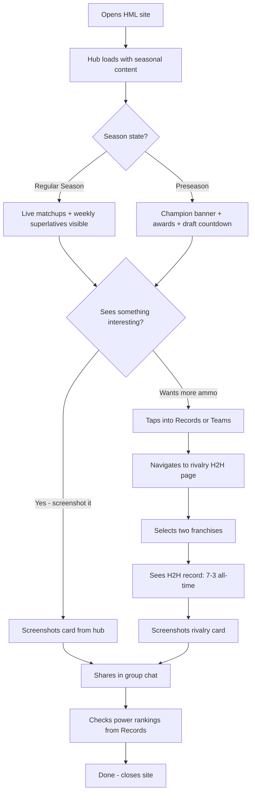
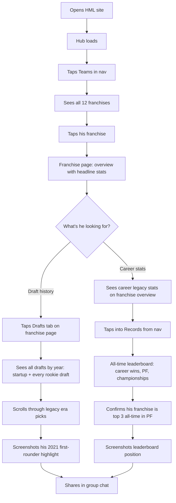
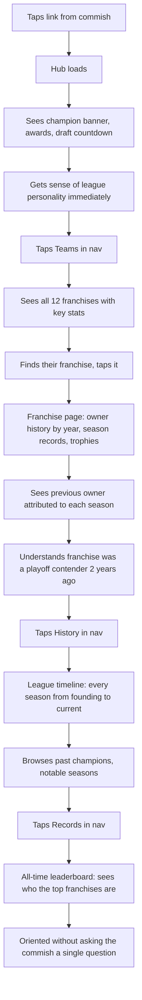
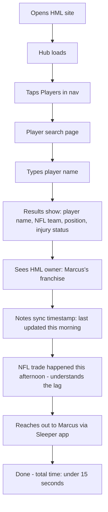
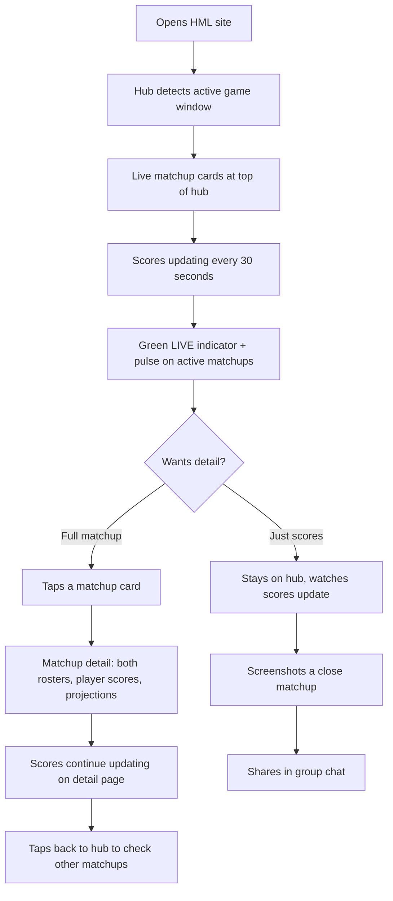

# UX Design Specification FantasyWebsite

**Author:** Blake
**Date:** 2026-03-25

---

<!-- UX design content will be appended sequentially through collaborative workflow steps -->

## Executive Summary

### Project Vision

The HML Website redesign transforms a functionally complete but visually flat league site into an engaging, seasonally aware destination that feels like opening a premium sports magazine on your phone. The core data and architecture remain unchanged; the redesign focuses on the dashboard/hub experience and visual presentation layer. The site should reward every visit with curated, contextual content (not just raw data), shifting based on where we are in the football calendar: preseason draft hype, regular season matchup energy, playoff intensity, and offseason reflection.

### Target Users

1. **The Casual Member** — mobile-first, wants rivalry stats and screenshot-worthy ammunition for the group chat
2. **The Stats Nerd** — deep-dives into draft history, career legacy stats, all-time leaderboards
3. **The Commish** — needs the site to be the authoritative record; will publish weekly recaps in Phase 2
4. **The New Manager** — needs orientation on franchise history, competition, league landscape
5. **The Dynasty Manager** — quick in-and-out player status checks for trade intel

### Key Design Challenges

- **Seasonal awareness without complexity** — the hub must feel fresh and contextual year-round (preseason draft countdown + awards, regular season live scores + standings, playoffs bracket focus, offseason recaps) without requiring manual content management. All driven by data already in the system.
- **"Clean but not bland"** — the Press Box theme provides a solid neutral foundation, but needs strategic color, typography punch, and card-based layouts to make key content pop. The 440andfriends model: calm base, vibrant callouts.
- **Mobile card-first data presentation** — stats, awards, and standings need to feel native on a phone screen. Cards over tables wherever possible. Tables reserved for deep-dive contexts where density is appropriate.
- **Curated over comprehensive on the hub** — the homepage should surface the 4-6 most compelling things (last year's champ, award winners, draft countdown, draft order) rather than linking to everything.

### Design Opportunities

- **Seasonal hub states** — a homepage that evolves through the football year creates a reason to come back; each visit feels current rather than static
- **Award cards as visual moments** — positional awards (best QB, WR, RB, TE) and team stat awards (most PF, least PA) as rich, glanceable cards give the preseason hub personality and trash-talk fuel
- **Draft countdown as a centerpiece** — a visible countdown timer to the rookie draft creates anticipation and gives the preseason hub a focal point
- **Strategic color accents on a neutral canvas** — using the Press Box palette more boldly (gold for achievements, green for active/live states) against the warm neutral background can create visual hierarchy without clutter

## Core User Experience

### Defining Experience

The core experience is **finding ammunition**. Every visit to the HML site, regardless of season, ends with the same outcome: a league member finds something worth sharing in the group chat. The site is a trash talk arsenal backed by real data. The hub serves up the most provocative, brag-worthy, or roast-worthy content for the current moment in the football calendar; deeper pages provide the receipts.

The core loop: **Land > See something interesting > Screenshot or share > Group chat erupts.**

### Platform Strategy

- **Mobile-first web app** — the primary context is a phone during lunch, on the couch, or mid-group-chat-argument
- **Touch-optimized** — tap targets sized for thumbs, card-based layouts that scroll naturally, no hover-dependent interactions
- **No offline requirement** — always-connected use case; data freshness matters more than offline access
- **Share-optimized** — clean URLs, card layouts that screenshot well with clear context (the screenshot should make sense without the surrounding page)
- **No app install** — browser-based, shareable links that work immediately for anyone in the league

### Effortless Interactions

- **Landing on the hub should immediately surface something interesting** — zero taps required to find a stat, award, or matchup worth reacting to
- **Seasonal context is automatic** — the hub knows what time of year it is and serves the right content without the user choosing a mode
- **Navigating between franchise/rivalry/records pages should feel like flipping through a magazine** — fast, visual, and each page has a clear "headline" moment
- **Live scores during game windows just work** — scores update in place, no refresh, no spinner, the page feels alive
- **Deep stats are always one tap from the surface** — award cards link to full breakdowns, rivalry cards link to full H2H history, standings link to season detail

### Critical Success Moments

1. **First visit: "This is way better than the Sleeper app for this"** — the hub shows curated, contextual content that Sleeper doesn't surface (awards, rivalry records, best possible roster, closest wins). The value is immediately obvious.
2. **The screenshot moment** — a user sees an award card, rivalry record, or stat callout and screenshots it. The card is self-contained: the stat, the context, and the franchise identity are all visible in one frame. This is the moment the site earns its place in the group chat.
3. **The argument settler** — two managers disagree about who's better historically. The H2H rivalry page settles it with data spanning every season including the legacy era. The site becomes the authority.
4. **Game day energy** — during NFL game windows, the hub transforms: live scores front and center, matchup cards with real-time updates, the site feels active and alive rather than a static archive.

### Experience Principles

1. **Trash talk first** — every design decision filters through "does this give someone something to brag about or roast someone with?" If a page doesn't generate group chat energy, it's not pulling its weight.
2. **Speed to stat** — the most compelling content surfaces with zero taps. Deeper data is always one tap away. Never more than two taps from any stat in the system.
3. **Screenshot-worthy by default** — cards, awards, and stat callouts are designed as self-contained visual moments. Clear context, bold typography, franchise identity visible. A screenshot of any card should make sense dropped into a group chat with no explanation.
4. **The site knows what season it is** — the hub is always contextually relevant. Preseason serves draft hype and last-year awards. Regular season serves matchups, standings, and weekly superlatives. Playoffs narrow the focus. Offseason reflects.
5. **Cards over tables, always on mobile** — data lives in cards on the hub and mobile views. Tables are reserved for deep-dive pages on larger screens where density is appropriate (full draft boards, complete season results).

## Desired Emotional Response

### Primary Emotional Goals

- **Competitive fire** — the site should make you feel something. Whether it's pride in your franchise's record or the sting of seeing your worst stat highlighted, the emotional response is never neutral. The site fuels the rivalry.
- **"This league is legit"** — underneath the trash talk, there's genuine respect for the institution. The site's quality, the depth of history, the completeness of the record; it all signals that the HML is a real thing worth being part of.
- **Mischievous discovery** — every visit should feel like finding a loaded weapon. "Oh, you think you're good? Look at this stat." The site actively helps users find roast material.

### Emotional Journey Mapping

| Moment | Desired Emotion |
|---|---|
| **First landing** | "Oh damn, this is legit." Impressed by the quality, immediately drawn in by a bold stat or award card. |
| **Browsing the hub** | Playful curiosity. Scrolling through cards, each one a potential screenshot. "Wait, who had the worst record last year?" |
| **Finding a rivalry stat** | Competitive heat. Either pride ("I own you historically") or the sting of seeing the data go against you. Either way, it's going in the group chat. |
| **Seeing your franchise roasted** | It stings, but it's fun. The site's snarky tone makes it feel like banter, not a personal attack. You're already planning your comeback. |
| **Seeing your franchise celebrated** | Earned pride. Gold accents, bold typography, the site treats your achievement like it matters. Screenshot-worthy bragging rights. |
| **Returning next week (in-season)** | "What happened this week?" Discovery energy. New weekly superlatives, updated standings, fresh roast material from the latest results. |
| **Returning in preseason** | Anticipation. Draft countdown ticking, last year's awards reminding everyone where things stand, draft order stoking speculation. |
| **Something goes wrong (stale data, error)** | Calm confidence. The site never panics; shows last known data with a timestamp. Feels reliable even when Sleeper hiccups. |

### Micro-Emotions

- **Confidence over confusion** — the site always knows what to show you. No dead ends, no "what do I click?" moments. Navigation is obvious, hierarchy is clear.
- **Belonging over isolation** — the site reinforces that you're part of something with history and stakes. Even the new manager feels the weight of their franchise's legacy.
- **Delight over mere satisfaction** — the snarky copy, the sting of a bad stat, the gold glow on an award card; these are deliberate moments of emotional texture, not just data delivery.
- **Excitement over anxiety** — game day energy should feel thrilling, not stressful. Live scores are smooth and confident, not janky and uncertain.

### Design Implications

- **Confident, snarky voice** — the site has personality in its copy. Superlative labels can poke fun ("League Doormat," "Glass Cannon," "Draft Day Genius"). This isn't a neutral dashboard; it has opinions.
- **Losses sting visually** — worst stats, longest losing streaks, and bad records are presented with the same visual confidence as wins. No hiding from the data. The design leans into it with bold callouts.
- **Gold for glory, bold type for pain** — achievements get the warm gold accent treatment. Bad records get bold, unflinching typography. Both are designed to provoke a reaction.
- **Weekly "What's New" surface (in-season)** — the hub refreshes with weekly superlatives after Tuesday night/Wednesday morning: biggest blowout, closest win, best possible roster, biggest underperformer. Each one is a fresh card, a fresh screenshot opportunity.
- **Preseason anticipation design** — the draft countdown, draft order, and previous year awards create a "the next chapter is coming" feeling. The site bridges the gap between seasons rather than going dormant.

### Emotional Design Principles

1. **The site has a voice** — it's not a neutral data viewer. It's confident, a little snarky, and it pokes fun. Think "the friend in the group chat who always has the receipts."
2. **Make it sting, make it glow** — bad stats and losses are highlighted with the same design care as wins and records. The emotional range is part of the experience. No one gets a pass.
3. **Every card is a reaction** — each visual moment on the hub is designed to provoke something: pride, shame, laughter, an argument. If it doesn't make someone feel something, it doesn't belong on the surface.
4. **Earned celebration** — when the site celebrates a franchise (championship, record, award), it feels real. Gold accents, display typography, the full treatment. Achievements are treated as moments, not line items.
5. **Weekly freshness (in-season)** — the hub feels alive during the season. After each week closes, new superlatives and callouts appear. The site rewards the habit of checking in every Wednesday.

## UX Pattern Analysis & Inspiration

### Inspiring Products Analysis

**440andfriends.com (Fantasy League Site)**
- Clean neutral base with strategic color pops for emphasis; proves the "calm canvas, vibrant callouts" approach works for fantasy league sites
- Hub with curated callouts: previous year's winner, key stats, draft countdown, calendar; not a data dump but a curated editorial surface
- Demonstrates that a fantasy league site can feel premium without being overdesigned

**Sleeper (Fantasy Platform)**
- Excellent data presentation: rosters feel complete and glanceable, weekly matchup views are the gold standard for "at a glance, who's winning"
- Player headshots add enormous visual value; transforms a name + number into a recognizable moment. HML should leverage the player image data available from Sleeper's ecosystem
- Stats are dense but well-organized; proves you can show a lot of data without overwhelming if hierarchy is right
- What Sleeper does poorly for HML's use case: no historical cross-season view, no rivalry records, no awards or superlatives, no editorial voice. It's a platform, not an institution. That's the gap HML fills.

**Apple (Product & Marketing UX)**
- The master class in confident minimalism: generous whitespace, bold typography as the hero, letting one element breathe rather than cramming the viewport
- Smooth transitions and scroll interactions that make browsing feel effortless; the "magazine flip" quality we want for navigating between franchise pages and stat views
- Information hierarchy is ruthless: one headline, one supporting detail, one action. Everything else is below the fold or on a deeper page. This discipline is critical for the HML hub.
- Typography does the heavy lifting. Apple rarely needs icons or illustrations because the type itself creates visual moments. This aligns perfectly with the Press Box theme where "the number IS the visual moment."
- Color is used surgically: mostly monochrome with one accent color per context. Maps directly to our "warm neutral canvas + strategic color pops" approach.

### Transferable UX Patterns

**Navigation Patterns:**
- **Sleeper's tab-based roster/matchup switching** — compact, thumb-friendly navigation between related views. Apply to franchise pages (overview / roster / draft history) and season pages (standings / matchups / playoffs).
- **Apple's minimal persistent nav** — a quiet, confident navigation bar that stays out of the way until needed. The HML nav should be slim and unobtrusive; the content is the star.

**Interaction Patterns:**
- **Sleeper's matchup card layout** — two teams, scores prominent, roster details expandable. Adapt for HML's matchup view and live score hub cards.
- **Apple's scroll-to-reveal content** — on the hub, content appears as you scroll. Each card section is a full "moment" before the next one enters. Prevents the hub from feeling like a wall of data.
- **Player headshots as visual anchors** — Sleeper proves that a face next to a stat line transforms data into a story. Use player images on award cards, roster views, and matchup details wherever available.

**Visual Patterns:**
- **Apple's typography-first hierarchy** — massive display numbers for key stats, medium weight for context, light weight for supporting data. No decorative elements needed when the type is doing the work.
- **440andfriends' color pop on neutral base** — most of the page is calm and neutral; color enters only for achievements, live states, and calls to action. Prevents visual fatigue.
- **Sleeper's data density with clear hierarchy** — roster views pack a lot of information but use size, weight, and spacing to create a readable scan pattern. Apply to standings, leaderboards, and draft boards.

### Anti-Patterns to Avoid

- **ESPN/Yahoo's visual clutter** — ads, banners, competing CTAs, and 47 things above the fold. HML should feel like the opposite: curated, intentional, breathing room.
- **Generic fantasy template aesthetics** — dark backgrounds, neon accents, aggressive gradients, "FANTASY FOOTBALL" in Impact font. The Press Box theme exists specifically to reject this. HML should feel more like The Athletic than FanDuel.
- **Sleeper's platform anonymity** — Sleeper is powerful but personality-free. HML's snarky voice and editorial POV are the differentiator. Never fall back to neutral data-viewer mode.
- **Dashboard overload** — showing every stat, every table, every link on the homepage. The hub is a curated editorial surface with 4-6 cards, not a sitemap with numbers.
- **Hover-dependent interactions** — anything that only works with a mouse cursor. This is a phone-first site. Every interaction must be touch-native.
- **Tiny tap targets and dense table rows on mobile** — cards with generous padding, not 12px table rows that require surgical finger precision.

### Design Inspiration Strategy

**What to Adopt:**
- Apple's typography-first hierarchy and generous whitespace; let bold numbers and type weights create the visual moments
- Sleeper's player headshots as visual anchors on award cards, rosters, and matchup views
- 440andfriends' curated hub approach with seasonal callouts and countdown
- Apple's surgical use of color: mostly neutral, one accent per context

**What to Adapt:**
- Sleeper's matchup card layout, simplified for the hub (two teams, score, key player) and expanded on detail pages
- Sleeper's roster view, adapted with HML's snarky editorial labels and franchise branding
- Apple's scroll-to-reveal pattern, applied to hub card sections so each is a distinct visual moment

**What to Avoid:**
- ESPN/Yahoo visual density and ad-driven layout chaos
- Generic fantasy sports template aesthetics (dark, neon, aggressive)
- Sleeper's personality-free neutrality; HML always has a voice
- Any interaction pattern that requires hover or assumes desktop-first usage

## Design System Foundation

### Design System Choice

**Themeable System: shadcn/ui (Radix UI primitives) + Tailwind CSS v4 with aggressive brand customization.**

The design system is a two-tier approach: shadcn/ui provides accessible, proven primitives for utility components, while signature components are built from scratch with Tailwind for maximum creative control over the HML brand experience.

### Rationale for Selection

- **Already aligned with architecture decisions** — shadcn/ui + Tailwind v4 is the locked-in tech stack; no new dependencies or library debates
- **Copy-and-own model** — shadcn/ui components are copied into the project, not installed as a dependency. Full control to restyle, extend, or gut any component without fighting upstream opinions
- **Tailwind v4 enables the Press Box theme completely** — custom color tokens, typography scale, spacing system, and component variants all defined in CSS with zero runtime cost
- **Accessibility built into the foundation** — Radix UI primitives handle focus management, keyboard navigation, and ARIA attributes. The snarky personality lives in the visual and copy layer, not in the interaction layer
- **The personality comes from customization, not the framework** — shadcn/ui defaults are intentionally neutral. The HML brand (confident, snarky, typography-forward) is built on top through Tailwind theme configuration and custom component design

### Implementation Approach

**Tier 1: Signature Components (Built from Scratch with Tailwind)**
Custom-designed for maximum brand impact and screenshot-worthiness:
- **Award cards** — positional awards (Best QB, WR, RB, TE) and team stat awards (Most PF, Least PA). Bold typography, gold accents, player headshot (when available), snarky label. The flagship visual moment.
- **Matchup cards** — two franchises, score prominent, key stat or player callout. Adapts for live (green pulse) and final (bold result) states.
- **Rivalry cards** — H2H record, win streak, last meeting result. Designed to provoke screenshots.
- **Hub hero cards** — draft countdown, reigning champion callout, weekly superlatives. Each is a self-contained visual moment.
- **Stat callout cards** — "League Doormat," "Glass Cannon," "Draft Day Genius" style superlative highlights with personality baked into the design.

**Tier 2: Utility Components (shadcn/ui Primitives, Restyled)**
Proven patterns restyled to match the Press Box theme:
- **Data tables** — standings, full draft boards, season results. shadcn/ui table with Press Box typography, warm borders, and tabular figures.
- **Navigation** — slim, confident top nav. shadcn/ui nav primitives with brand styling.
- **Tabs** — franchise page sections (overview / roster / drafts), season sections. shadcn/ui tabs with brand treatment.
- **Badges** — "W", "L", "CHAMP", "STREAK" labels. shadcn/ui badge with HML color tokens and snarky copy.
- **Dropdowns/selectors** — season picker, franchise picker. shadcn/ui select with brand styling.
- **Cards (base)** — shadcn/ui card primitive as the foundation for Tier 1 signature cards where appropriate.

### Customization Strategy

**Theme Tokens (Tailwind v4 CSS):**
- Full Press Box color palette defined as CSS custom properties: warm neutrals for canvas, forest green for brand accent, antique gold for achievements, warm grays for text hierarchy
- Typography scale locked to Geist Sans with defined size/weight/spacing for Display, H1, H2, H3, Body, Caption
- 8px base spacing unit enforced through Tailwind spacing config
- Tabular figures (`font-variant-numeric: tabular-nums`) applied globally to all numeric content

**Component Personality Layer:**
- Snarky superlative labels defined as a content system (not hardcoded per component): "League Doormat," "Glass Cannon," "Point Machine," "Draft Day Genius," etc.
- Visual treatments for positive (gold accent, bold type) and negative (bold type, unflinching callout) stat moments
- Live/active state: forest green dot or subtle pulse animation
- Seasonal hub state logic determines which card types render on the homepage

**Player Headshot Strategy (Progressive Enhancement):**
- Player images sourced from available NFL/Sleeper image endpoints
- Award cards, roster views, and matchup details display headshots when available
- Graceful fallback: position icon or styled initials when no image exists
- Headshots are never a blocker for any feature; they enhance but are not required

## Core Defining Experience

### Defining Experience

**"Open the site, find something to fire into the group chat."**

The HML site's defining experience is the moment between landing and screenshotting. Whether a user is browsing the hub (discovery mode) or hunting a specific stat (search mode), the outcome is the same: they find something worth sharing. The site is a trash talk arsenal disguised as a league history archive.

The one-sentence pitch: **"The site that settles every argument and starts new ones."**

### User Mental Model

**Current solution: Sleeper + memory + group chat arguments.**

Users currently piece together league knowledge from:
- The Sleeper app for current season data (rosters, matchups, standings)
- Personal memory and group chat history for historical claims ("I've beaten you 7 of the last 10")
- Manual lookups across multiple Sleeper seasons for historical data (painful, slow, often abandoned)
- The "trust me bro" method for any stat that's hard to verify

**The core frustration:** The data exists somewhere in Sleeper, but accessing anything historical is painful. Previous seasons require navigating to old league instances. Cross-season stats (career records, all-time H2H, draft history across years) are effectively impossible to compile without manual spreadsheet work. Arguments go unresolved because the effort to prove a claim exceeds the payoff.

**The mental model HML creates:** One place, all history, instant answers. Users should think of HML the way they think of Basketball Reference or Pro Football Reference: "If it happened in this league, it's on the site." The difference is that HML has personality and editorial voice; it's not just a database, it's the league's narrator.

### Success Criteria

The core experience succeeds when:

1. **Under 5 seconds from landing to "oh, interesting"** — the hub surfaces something compelling (an award, a stat, a matchup result) before the user has to tap anything
2. **Under 10 seconds from question to answer** — "Who has the best all-time record against Marcus?" should be answerable in two taps: navigate to rivalries, select the two franchises
3. **The screenshot is self-contained** — any card or stat view contains enough context (franchise names, stat label, value, timeframe) that it makes sense in a group chat without explanation
4. **Historical data just works** — a user looking up 2019 draft picks or a 2021 rivalry record finds it exactly where they expect it, including the legacy 10-team era. No gaps, no "data unavailable" for completed seasons.
5. **The hub feels different each visit (in-season)** — returning on Wednesday after the week closes should reveal fresh weekly superlatives: closest win, biggest blowout, best possible roster, biggest underperformer

### Novel UX Patterns

**Primarily established patterns, combined in a novel way for the fantasy league context.**

The individual components are familiar:
- Card-based hub layouts (established: news apps, sports apps, dashboards)
- Countdown timers (established: event sites, product launches)
- Stat tables and leaderboards (established: sports reference sites, fantasy platforms)
- Seasonal/contextual content (established: retail, media sites)

**What's novel is the combination and the voice:**
- A fantasy league site that behaves like a curated sports magazine rather than a data dump
- Seasonal hub states that automatically shift content based on the football calendar (no CMS, no manual curation; driven entirely by data and date logic)
- Snarky editorial labels ("League Doormat," "Glass Cannon") as first-class UI elements, not just tooltip flavor text
- Weekly superlative cards (closest win, best possible roster, biggest underperformer) as auto-generated "content" that refreshes the hub without any manual effort
- The "best possible roster" concept: showing what your optimal lineup would have scored that week; a stat that generates arguments and doesn't exist in Sleeper

**No new interaction patterns need to be taught.** Users know how to scroll cards, tap to go deeper, and read stats. The innovation is in what's surfaced, when, and with what attitude.

### Experience Mechanics

**Mode 1: Browse & Discover (Hub)**

1. **Initiation:** User opens the site or taps "Home." The hub loads with seasonally appropriate content.
2. **Interaction:** Scroll through card sections. Each section is a visual moment: draft countdown, reigning champion, award cards, weekly superlatives (in-season), draft order, fun stat callouts.
3. **Feedback:** Each card is self-contained and visually complete. Bold stats, franchise identity, snarky labels. The user knows they've found something interesting when they instinctively want to screenshot it.
4. **Completion:** User screenshots a card, copies a link, or taps into a deeper page for the full story. The hub has done its job.

**Mode 2: Hunt & Find (Deep Pages)**

1. **Initiation:** User has a specific question: "What's my H2H record against Jordan?" or "Who did I draft in 2022?" They navigate via the top nav (Records, Teams, Drafts) or tap a hub card that links to the relevant section.
2. **Interaction:** Navigate to the relevant page (rivalry lookup, franchise draft history, season detail). Select franchises, seasons, or filters as needed. Data loads server-side; no spinners, no waiting.
3. **Feedback:** The answer is immediate and definitive. Bold headline stat (e.g., "7-3 all-time"), supporting detail below (season-by-season breakdown), screenshot-worthy card format for the summary.
4. **Completion:** User has their answer. They screenshot the result, share the link, or browse related stats (other rivalries, other seasons). Every deep page links to related content: a franchise page links to that franchise's rivalries, draft history, and season records.

## Visual Design Foundation

### Color System

**Theme: "Press Box Evolved" — Warm, Institutional, with Confident Pops**

The core palette stays warm and neutral, but we add more deliberate contrast between the calm canvas and the moments that need to pop. The key evolution: the current site treats everything at the same visual "volume." The redesign creates clear tiers of visual intensity.

**Canvas & Surface (The Calm Base)**

| Token | Hex | Usage |
|---|---|---|
| `--canvas` | `#FAF8F5` | Page background; the default state |
| `--surface` | `#FFFFFF` | Card backgrounds; elevated content |
| `--surface-muted` | `#F5F2EE` | Subtle section dividers; alternating row backgrounds |
| `--border` | `#E8E4E0` | Card borders, dividers, table rules |
| `--border-strong` | `#D4CFC9` | Emphasized borders; active card outlines |

**Text Hierarchy (The Workhorse)**

| Token | Hex | Usage |
|---|---|---|
| `--text-primary` | `#1A1A1A` | Headlines, stat numbers, bold callouts |
| `--text-secondary` | `#4A4540` | Body text, descriptions, supporting context |
| `--text-tertiary` | `#7A756F` | Labels, metadata, timestamps, captions |
| `--text-muted` | `#9C9590` | Placeholder text, disabled states |

Note: `--text-secondary` has been darkened from the original `#6B6560` to improve contrast ratio on the warm canvas and ensure WCAG AA compliance at body text sizes.

**Accent Colors (The Pops)**

| Token | Hex | Usage |
|---|---|---|
| `--accent-green` | `#2D5A3D` | Brand accent, navigation active states, live/active indicators, CTAs |
| `--accent-green-light` | `#E8F0EB` | Green tint backgrounds for subtle emphasis |
| `--accent-gold` | `#B8860B` | Achievements, championships, awards, positive superlatives |
| `--accent-gold-light` | `#FDF6E3` | Gold tint backgrounds for award card surfaces |
| `--accent-warm` | `#C45D3E` | Negative superlatives, "sting" moments, loss callouts |
| `--accent-warm-light` | `#FDF0EC` | Warm tint backgrounds for loss/negative stat cards |

**Color Blindness Safety Protocol:**
- Red/purple pairings are banned entirely (league member with red/purple color blindness)
- `--accent-warm` is a warm rust/terra cotta (`#C45D3E`), not a true red; chosen specifically to be distinguishable from green for the most common forms of color blindness (protanopia, deuteranopia)
- Every color signal is paired with a text label, icon, or typographic treatment: "W"/"L" badges, "CHAMP" labels, bold/regular weight for wins/losses
- Gold and green are naturally distinguishable across all common color blindness types
- No information is ever conveyed by color alone; color reinforces meaning that's already communicated through text and typography

**Semantic Mappings:**

| Semantic Role | Token | Secondary Indicator |
|---|---|---|
| Win / Positive | Bold type weight | "W" label or upward context |
| Loss / Negative | Regular type weight | "L" label or downward context |
| Championship / Award | `--accent-gold` | "CHAMP" badge, trophy icon, gold tint card |
| Live / Active | `--accent-green` | Green dot + "LIVE" text label + subtle pulse |
| Worst / Sting | `--accent-warm` | Snarky text label ("League Doormat") + bold callout |
| Streak | `--accent-gold` (positive) / `--accent-warm` (negative) | "W3"/"L5" text label always present |

### Typography System

**Typeface: Geist Sans (via next/font) — Single Family, Full Range**

No secondary typeface. All hierarchy through size, weight, and spacing. This is the Apple approach: one family, ruthlessly applied.

**Type Scale:**

| Level | Size | Weight | Letter Spacing | Line Height | Usage |
|---|---|---|---|---|---|
| Display | 56-64px | Black (900) | -0.02em | 1.05 | Hero stats on hub; the number IS the visual moment |
| H1 | 36-40px | Bold (700) | -0.015em | 1.15 | Page titles |
| H2 | 28-32px | Bold (700) | -0.01em | 1.2 | Section headers, card group titles |
| H3 | 20-24px | Medium (500) | 0 | 1.3 | Card titles, subsection headers |
| Body Large | 18px | Regular (400) | 0 | 1.5 | Featured descriptions, hub card body text |
| Body | 16px | Regular (400) | 0 | 1.5 | Standard text, table cells |
| Body Small | 14px | Regular (400) | 0.005em | 1.45 | Labels, metadata, timestamps |
| Caption | 12px | Medium (500) | 0.06em | 1.35 | Badges, tags, micro-labels; UPPERCASE with wide tracking |
| Stat Number | Contextual | Bold (700) | -0.01em | 1.0 | Stat values in tables and cards; always `tabular-nums` |

**Typography Principles:**
- **Display is for one number per viewport.** If you're using Display size, it's the single most important stat on the screen. Hub hero cards, franchise page headline stat, rivalry H2H total.
- **Negative tracking on large text.** Display and H1 use tight letter spacing for that premium, magazine-cover feel.
- **Wide tracking on Caption.** Uppercase micro-labels ("BEST QB," "LEAGUE DOORMAT," "WEEK 9") use wide letter spacing for authority and readability at small sizes.
- **Tabular figures everywhere stats appear.** `font-variant-numeric: tabular-nums` applied to all numeric content so columns align and scores don't shift during live updates.
- **Weight creates hierarchy, not just size.** A Bold 16px stat value next to a Regular 16px label creates clear hierarchy without needing different sizes. This is critical for data-dense views like tables and roster cards.

### Spacing & Layout Foundation

**Base Unit: 8px**

All spacing derives from 8px multiples. No exceptions.

| Token | Value | Usage |
|---|---|---|
| `--space-1` | 4px | Tight internal padding (badge text, icon gaps) — the only sub-8px value |
| `--space-2` | 8px | Minimum component internal padding |
| `--space-3` | 12px | Compact list item spacing |
| `--space-4` | 16px | Standard component padding; mobile horizontal gutter |
| `--space-6` | 24px | Card internal padding; between related elements |
| `--space-8` | 32px | Between cards in a group; section internal spacing |
| `--space-12` | 48px | Between card groups / sections on the hub |
| `--space-16` | 64px | Major section breaks |
| `--space-24` | 96px | Page top/bottom padding on desktop |

**Layout Grid:**

- **Max content width:** 1200px, centered
- **Mobile:** Single column, 16px horizontal padding, full-bleed cards
- **Tablet (768px+):** 2-column card grid for hub, single column for deep pages
- **Desktop (1024px+):** 2-3 column card grid for hub; content pages stay single column with max-width for readability

**Layout Principles:**

1. **Generous whitespace is non-negotiable.** The warm cream canvas is a design element, not empty space. Let cards breathe. Apple-level margins between sections.
2. **Cards are full-bleed on mobile.** Edge-to-edge card backgrounds with internal padding. No awkward side margins that shrink the already small viewport.
3. **One visual moment per scroll stop.** Each hub card section should fill roughly one mobile viewport height. Scroll, stop, absorb, scroll. Magazine pacing.
4. **Asymmetric layouts for visual interest.** On desktop, the hub can use mixed-width cards (one large hero card + two smaller stat cards in a row) instead of uniform grids. Prevents the "spreadsheet" feeling.
5. **Section titles are anchors.** Hub card groups get clear, confident section headers ("Last Season's Best," "Draft Countdown," "This Week's Damage") that create rhythm and scannability.

### Accessibility Considerations

**WCAG 2.1 AA Compliance (Non-Negotiable):**

| Check | Requirement | Our Approach |
|---|---|---|
| Body text contrast | 4.5:1 minimum | `--text-secondary` (#4A4540) on `--canvas` (#FAF8F5) = 7.2:1 |
| Large text contrast | 3:1 minimum | `--text-primary` (#1A1A1A) on `--canvas` (#FAF8F5) = 14.8:1 |
| Interactive elements | 3:1 minimum | `--accent-green` (#2D5A3D) on `--canvas` (#FAF8F5) = 6.1:1 |
| Focus indicators | Visible focus ring | 2px solid `--accent-green` with 2px offset |

**Color Blindness Accommodations:**
- No red/purple pairings anywhere in the interface
- `--accent-warm` (rust/terra cotta) chosen for maximum distinguishability from `--accent-green` across protanopia and deuteranopia
- All color-coded content includes text labels: "W"/"L" for wins/losses, "LIVE" for active states, "CHAMP" for championships
- Badges always include text, never rely on background color alone
- Charts or visualizations (if added later) must use pattern fills in addition to color

**Touch Accessibility:**
- Minimum tap target: 44x44px (WCAG 2.1 AA)
- Card tap targets extend to full card area, not just text
- Adequate spacing between adjacent interactive elements (minimum 8px gap)

## Design Direction Decision

### Design Directions Explored

Six directions were generated and evaluated as interactive HTML mockups (`ux-design-directions.html`):

1. **Magazine Editorial** — typography-led, maximum breathing room
2. **Bold Cards** — green-branded, 2-column card grid, maximum color
3. **Minimal Typographic** — ultra-minimal, pure type and whitespace
4. **Dashboard Grid** — tight tile grid, information-dense
5. **Hybrid** — magazine pacing with card personality
6. **Immersive Scroll** — full-viewport sections, horizontal scroll cards

### Chosen Direction

**Direction 5 (Hybrid) as the base, enhanced with elements from Direction 2 (Bold Cards).**

The hybrid's magazine pacing and section structure is the foundation. The bold cards direction contributes its champion callout treatment and 2-column card grid for positional awards.

### Design Rationale

- **Champion callout uses the Bold Cards treatment** — the full-width green hero card with gradient and trophy icon has the most visual impact. It's the first thing you see, it's screenshot-worthy, it sets the tone.
- **Positional award cards shift to a 2-column grid** — square-ish cards (like Direction 2) instead of full-width list cards. This uses horizontal space better on mobile, makes each award feel like its own moment, and creates a more dynamic visual rhythm.
- **Team awards (Most PF, Best Defense, etc.) rank above player awards** — team stats are more directly tied to trash talk and bragging rights. "My team scored the most points" is a stronger group chat message than "my QB scored the most points."
- **Wall of Shame keeps the full-width list style** — the wider format gives room for the snarky label, team name, context line, and stat. These cards benefit from horizontal space because the personality is in the copy, not just the number.
- **Section headers with "View All" links** — clear hierarchy and navigation depth without cluttering the hub.
- **"Preseason" pill badge in nav** — subtle seasonal context indicator that changes with the football calendar.
- **Countdown card stays centered and prominent** — the draft countdown is a focal point that creates anticipation.

### Implementation Approach

**Hub Layout Order (Preseason State):**

1. **Nav bar** — HML brand left, seasonal pill badge right ("Preseason")
2. **Champion banner** — full-width green gradient card with team name, record, opponent, trophy icon (Bold Cards style)
3. **Draft countdown** — centered card with days/hours/min/sec
4. **"Team Awards" section** — section header with "View All" link, followed by 2-column grid of square-ish cards (Most PF, Best Defense/Least PA, etc.) using gold tint backgrounds
5. **"Last Season's Best" section** — section header with "View All" link, followed by 2-column grid of square-ish cards (Best QB, Best RB, Best WR, Best TE) using gold tint backgrounds
6. **"Wall of Shame" section** — section header, full-width list-style sting cards (League Doormat, Glass Cannon, etc.) using warm tint backgrounds
7. **"Draft Order" section** — section header with "Full Draft" link, compact list card showing first-round order

**Card Anatomy (2-Column Player Award Cards):**

```
┌─────────────────────┐
│ BEST QB        (cap)│  <- Gold accent, uppercase caption
│                     │
│    [headshot]       │  <- Player headshot (circle), fallback: position icon
│                     │
│   Josh Allen  (name)│  <- Player name, bold, centered
│  Team Harambe (team)│  <- Owning franchise, tertiary, centered
│                     │
│   412.8 pts   (stat)│  <- Stat + unit on one line
└─────────────────────┘
```

Player is the hero of the card. Headshot centered and prominent when available; graceful fallback to position icon or styled initials. Stat and unit paired on a single line for tightness.

**Card Anatomy (2-Column Team Award Cards):**

```
┌─────────────────────┐
│ POINT MACHINE  (cap)│  <- Gold accent, uppercase snarky label
│                     │
│     2,147      (stat)│  <- Large stat number, centered
│    Total PF    (unit)│  <- Context label
│                     │
│ Gorilla Warfare(name)│  <- Franchise name, bold
│ Most Points For(desc)│  <- Award description, tertiary
└─────────────────────┘
```

Stat is the hero of the card (no headshot). Franchise name below.

**Card Anatomy (Full-Width Sting Cards):**

```
┌──────────────────────────────────────────────┐
│ LEAGUE DOORMAT                        3-14   │
│ Team Banana Stand                   Record   │
│ Worst record since the legacy era            │
└──────────────────────────────────────────────┘
```

Warm tint background, accent-warm label, stat right-aligned. Horizontal layout uses the full width for the snarky context line.

## User Journey Flows

### Navigation Structure

**Primary Nav (Persistent, All Seasons):** Hub | Teams | Records | History | Drafts | Players

**Matchups:** Not a nav item. During the regular season, live matchup cards surface directly on the hub. Tapping a matchup card navigates to its detail page (`/matchups/` routes). During preseason/offseason, matchup data is accessible through History > Season > Week.

### Journey 1: The Casual Member — Weekly Trash Talk Run (Marcus)

**Entry:** Hub (mobile, Tuesday lunch after a loss)
**Goal:** Find ammunition, screenshot it, fire it into the group chat



**Key design moments:**
- Hub immediately shows something screenshottable (zero taps)
- Rivalry lookup is max 2 taps from hub: Records > Head-to-Head
- Every result screen has a self-contained card format optimized for screenshots

### Journey 2: The Stats Nerd — Historical Deep Dive (Jordan)

**Entry:** Hub (desktop, wants to prove he has the best draft history)
**Goal:** Find career stats and draft history spanning all seasons including legacy era



**Key design moments:**
- Franchise page is the hub for team-specific deep dives; tabs for overview / roster / drafts
- Draft history organized by year, clearly spanning legacy and current eras
- All-time leaderboard on Records page is the authority for career stats
- Every stat view includes the timeframe ("All-time, including legacy era") for context

### Journey 3: The New Manager — Getting Oriented (Taylor)

**Entry:** Hub (mobile, commish just sent the link)
**Goal:** Understand franchise history, league landscape, who the competition is



**Key design moments:**
- Hub immediately communicates league personality and culture
- Teams page shows all franchises at a glance with enough context to understand the landscape
- Franchise page clearly shows year-attributed ownership (Taylor sees who owned the franchise before them)
- History timeline makes the league feel like an institution with depth

### Journey 4: The Dynasty Manager — Player Status Check (Darnell)

**Entry:** Hub (mobile, Saturday afternoon, a real-life NFL trade just happened)
**Goal:** Find out who owns a specific player in the HML



**Key design moments:**
- Player search is one tap from any page via nav
- Results are immediate (server-side, no client loading state)
- Sync timestamp visible on results so user understands data freshness
- Player result includes all relevant context: HML owner, NFL team, position, status

### Journey 5: Game Day — Live Scores (Any Member)

**Entry:** Hub (mobile, Sunday afternoon during NFL games)
**Goal:** Check live matchup scores



**Key design moments:**
- Hub automatically shows live matchups during game windows (no mode switching)
- LIVE indicator with green dot + text label (accessibility: not color-only)
- Scores update in place, no flash or spinner; smooth confidence
- Matchup detail page accessible from hub card tap; includes full roster breakdown

### Journey Patterns

**Entry Pattern:**
- 90% of journeys start at the hub
- Hub serves as both the discovery surface and the routing layer to deeper content
- Nav provides direct access to specific sections for repeat visitors who know where they're going

**Navigation Pattern:**
- **Breadth:** Top nav for major sections (Teams, Records, History, Drafts, Players)
- **Depth:** Tabs within pages for subsections (franchise page: overview / roster / drafts; Records: leaderboard / H2H / rivalries / power rankings / trophies)
- **Context links:** Hub cards link directly to relevant deep pages; "View All" links on section headers

**Screenshot Pattern:**
- Every journey includes at least one screenshot-worthy moment
- Cards are self-contained: stat + context + franchise identity visible in one frame
- No modal or overlay disrupts the screenshot frame

**Data Freshness Pattern:**
- Sync timestamp visible on every page (footer)
- Player search results show explicit "Last updated" context
- Live scores show LIVE indicator during game windows
- Stale data shows last-known values with timestamp, never blank states

### Flow Optimization Principles

1. **Hub is the router** — the hub does double duty: it's both the discovery/browse surface and the live-data surface. During game windows it shows matchups; during preseason it shows awards and draft info. No separate "matchups page" needed in the nav.
2. **Two taps to any stat** — from the hub, any specific stat (rivalry record, draft pick, player owner) is reachable in two taps maximum. Nav > page, or hub card > detail.
3. **Tabs over new pages** — franchise pages use tabs (overview / roster / drafts) instead of separate pages. Keeps context, reduces navigation, feels like flipping through a file.
4. **Progressive disclosure** — hub shows the headline; tapping reveals the full story. Award card shows "Best QB: Josh Allen, 412.8 pts"; tapping goes to full positional breakdown. Never overwhelm on the surface.
5. **Always a way back** — persistent nav means you're never lost. Hub is always one tap away. Back button behavior is predictable.

## Component Strategy

### Design System Components (shadcn/ui, Restyled)

**Available from shadcn/ui, used as-is with Press Box theming:**

| Component | Usage | Customization |
|---|---|---|
| **Table** | Standings, leaderboards, full draft boards, season results | Press Box typography, warm borders, tabular figures, alternating row backgrounds with `--surface-muted` |
| **Card (base)** | Foundation primitive for all custom card types | Warm border, surface background, 12px border-radius |
| **Tabs** | Franchise page sections (overview / roster / drafts), Records subsections | Brand-styled active indicator using `--accent-green` |
| **Badge** | "W", "L", "CHAMP", "STREAK", "LIVE", position labels | Custom color variants: gold (achievement), warm (sting), green (active) |
| **Navigation Menu** | Primary top nav | Slim, brand-styled, mobile hamburger |
| **Select** | Season picker, franchise picker | Brand-styled dropdown |
| **Input** | Player search | Warm border, focus ring with `--accent-green` |
| **Separator** | Section dividers | `--border` color |
| **Skeleton** | Loading states (if ever needed) | Warm-toned pulse |

### Custom Components

#### Tier 1: Hub Components (Signature, Built from Scratch)

---

**Champion Banner**

**Purpose:** Hero callout for the reigning league champion. Primary banner during preseason and offseason.
**Usage:** Hub top position during preseason and offseason states.

**Anatomy:**
```
┌──────────────────────────────────────────────────┐
│  (gradient: accent-green to dark green)          │
│                                                  │
│  2025 CHAMPION              (cap, white 60%)     │
│  Team Harambe               (h2, white, bold)    │
│  13-4 / Defeated Silverback (body, white 75%)    │
│                                    [trophy 30%]  │
│                                                  │
└──────────────────────────────────────────────────┘
```

**States:**
- Default: green gradient with trophy icon watermark
- Tappable: links to champion's franchise page

**Variants:** None; single instance on the hub.
**Accessibility:** Trophy icon is decorative (aria-hidden). Full champion info conveyed in text.

---

**Week Banner**

**Purpose:** Sets the context for the current week during the regular season and playoffs. Replaces Champion Banner as the top hero element once games begin.
**Usage:** Hub top position during regular season and playoff states.

**Anatomy:**
```
┌──────────────────────────────────────────────────┐
│  (gradient: accent-green to dark green)          │
│                                                  │
│  HARAMBE MEMORIAL LEAGUE    (cap, white 60%)     │
│  Week 9                     (h1, white, bold)    │
│  3 games in progress        (body, white 75%)    │
│                                                  │
└──────────────────────────────────────────────────┘
```

**States:**
- **Game window active:** "3 games in progress" with subtle pulse
- **Pre-kickoff:** "Games start Sunday 1:00 PM EST"
- **Week complete:** "Week 9 Final" with link to full results
- **Bye week context:** "6 matchups this week"

**Playoff variant:**
- Title changes to round name: "Wild Card Round," "Semifinal," "Championship"
- Context line shows remaining matchups or bracket status

**Accessibility:** All status info conveyed in text. Pulse animation is decorative only.

---

**Draft Countdown Card**

**Purpose:** Creates preseason anticipation with a live countdown to the next rookie draft.
**Usage:** Hub, preseason state only. Disappears once the draft begins.

**Anatomy:**
```
┌──────────────────────────────────────────────────┐
│  (surface background, border)                    │
│                                                  │
│         ROOKIE DRAFT COUNTDOWN (cap, green)      │
│                                                  │
│      42        07        33        12            │
│     DAYS      HOURS      MIN       SEC           │
│                                                  │
│         May 6, 2026 at 8:00 PM EST (tertiary)   │
└──────────────────────────────────────────────────┘
```

**States:**
- Active countdown: numbers update (client-side, simple interval)
- Draft day: transforms to "DRAFT DAY" with green accent treatment
- Post-draft: component removed from hub

**Accessibility:** Countdown numbers have aria-label "42 days, 7 hours, 33 minutes, 12 seconds until rookie draft."

---

**Player Award Card (2-Column Grid)**

**Purpose:** Showcases positional award winners (Best QB, RB, WR, TE) from the previous season.
**Usage:** Hub preseason state, "Last Season's Best" section. Also used on Records > Trophies page.

**Anatomy:**
```
┌─────────────────────┐
│ BEST QB        (cap)│  <- Gold accent, uppercase
│                     │
│    [headshot]       │  <- 64px circle, fallback: position icon
│                     │
│   Josh Allen  (name)│  <- Bold, centered
│  Team Harambe (team)│  <- Tertiary, centered
│                     │
│   412.8 pts   (stat)│  <- Bold stat + unit, single line
└─────────────────────┘
```

**States:**
- Default: gold-tint background (`--accent-gold-light`), gold border
- Tappable: links to full positional stats breakdown
- No headshot: position icon (silhouette with position abbreviation) in a neutral circle

**Variants:**
- Positional awards: QB, RB, WR, TE (gold tint)
- Could extend to other positional awards (FLEX, K, DEF) if desired

**Accessibility:** Card includes alt text for headshot: "Josh Allen headshot" or "QB position icon." Full stat context in text.

---

**Team Award Card (2-Column Grid)**

**Purpose:** Showcases team-level stat awards (Most PF, Least PA, etc.) from the previous season.
**Usage:** Hub preseason state, "Team Awards" section (above player awards). Also used on Records > Trophies page.

**Anatomy:**
```
┌─────────────────────┐
│ POINT MACHINE  (cap)│  <- Gold accent, snarky label
│                     │
│     2,147      (stat)│  <- Display-weight stat, centered
│    Total PF    (desc)│  <- Context, tertiary
│                     │
│ Gorilla Warfare(name)│  <- Bold franchise name
└─────────────────────┘
```

**States:**
- Default: gold-tint background, gold border
- Tappable: links to franchise page or full stat breakdown

**Variants:**
- Positive awards: gold tint (Most PF, Least PA, Best Record)
- Uses snarky labels from the content system ("Point Machine," "Iron Curtain," etc.)

---

**Sting Card (Full-Width)**

**Purpose:** Highlights negative superlatives with personality. The "Wall of Shame" component.
**Usage:** Hub preseason state, "Wall of Shame" section. Also used on Records pages for worst stats.

**Anatomy:**
```
┌──────────────────────────────────────────────────┐
│ LEAGUE DOORMAT (cap, warm)            3-14 (stat)│
│ Team Banana Stand (name, bold)       Record (unit)│
│ Worst record since the legacy era (desc, tertiary)│
└──────────────────────────────────────────────────┘
```

**States:**
- Default: warm-tint background (`--accent-warm-light`), warm border
- Tappable: links to franchise page

**Variants:**
- "League Doormat" (worst record), "Glass Cannon" (high PF, low wins), "Paper Tiger" (high PA), etc.
- Uses snarky labels from the content system

**Accessibility:** Warm accent color always paired with text label. Stat has unit label.

---

**Draft Order Card**

**Purpose:** Shows the upcoming rookie draft's first-round order.
**Usage:** Hub preseason state, "Draft Order" section.

**Anatomy:**
```
┌──────────────────────────────────────────────────┐
│  1.  Team Banana Stand                    3-14   │
│  ─────────────────────────────────────────────── │
│  2.  Team Jungle Fever                    5-12   │
│  ─────────────────────────────────────────────── │
│  3.  Team Monkey Business                 5-12   │
│  ─────────────────────────────────────────────── │
│  4.  Team Primate Time                    6-11   │
└──────────────────────────────────────────────────┘
```

**States:**
- Default: surface background, compact list
- "Full Draft" link in section header goes to Drafts page

**Variants:** Shows top 4 picks by default on hub; full 12-pick first round on Drafts page.

---

**Live Matchup Card**

**Purpose:** Displays a single matchup with live-updating scores during game windows.
**Usage:** Hub regular season state (game windows). Appears below Week Banner.

**Anatomy:**
```
┌──────────────────────────────────────────────────┐
│  LIVE (green dot + label)              WEEK 9    │
│                                                  │
│  Team Harambe                            127.4   │
│  Team Silverback                         118.9   │
│                                                  │
│  [Top scorer: Josh Allen 32.4 pts]  (tertiary)  │
└──────────────────────────────────────────────────┘
```

**States:**
- **Live:** green LIVE indicator with subtle pulse, scores updating every 30s
- **Final:** LIVE indicator replaced with "FINAL" badge, bold winner score, regular loser score
- **Upcoming:** scores show projected totals or "--", "SUN 1PM" time label
- **Close game:** optional highlight treatment when margin < 10 points

**Variants:**
- Compact (hub): two teams + scores + top scorer
- Expanded (matchup detail page): full rosters with individual player scores

**Accessibility:** LIVE state conveyed via "LIVE" text label, not just green dot. Score updates use aria-live="polite" for screen readers.

---

**Weekly Superlative Card**

**Purpose:** Highlights the most interesting stats from the completed week. Fresh content every Wednesday.
**Usage:** Hub regular season state, "This Week's Damage" section.

**Anatomy (varies by superlative type):**
```
┌──────────────────────────────────────────────────┐
│ CLOSEST WIN (cap, gold)                          │
│                                                  │
│ Team Harambe 118.4 - 117.9 Team Silverback       │
│ Won by 0.5 pts (stat, display weight)            │
└──────────────────────────────────────────────────┘
```

**Superlative types:**
- **Closest Win** — margin of victory, both teams and scores
- **Biggest Blowout** — margin, both teams (sting card style for the loser)
- **Best Possible Roster** — what the optimal lineup would have scored vs. what was actually started
- **Biggest Underperformer** — largest gap between optimal and actual lineup (sting treatment)
- **Highest Scorer** — team with most points that week (gold treatment)
- **Lowest Scorer** — team with fewest points (warm/sting treatment)

**States:**
- Default: card style varies by superlative (gold for positive, warm for negative, neutral for informational)
- Tappable: links to full week matchup results

**Accessibility:** All stats include text labels and context. No color-only information.

---

**Standings Snapshot Card**

**Purpose:** Quick glanceable current standings on the hub during the regular season.
**Usage:** Hub regular season state (outside game windows).

**Anatomy:**
```
┌──────────────────────────────────────────────────┐
│ STANDINGS — WEEK 9 (cap)        View Full →      │
│                                                  │
│  1. Team Harambe           8-1   (bold, green)   │
│  2. Team Silverback        7-2                   │
│  3. Team Gorilla Warfare   6-3                   │
│  ...                                             │
│  12. Team Banana Stand     1-8   (warm accent)   │
└──────────────────────────────────────────────────┘
```

**States:**
- Default: compact list, top 3 and bottom 1 shown on hub
- "View Full" links to Records > Current Standings

---

**Playoff Bracket Card**

**Purpose:** Visual bracket showing playoff matchups, results, and progression.
**Usage:** Hub playoff state (below Week Banner). Also on Playoffs detail page.

**Anatomy:**
```
┌──────────────────────────────────────────────────┐
│ PLAYOFFS — ROUND 1 (cap, green)                  │
│                                                  │
│  ┌─────────────┐                                 │
│  │ (1) Harambe ├──┐                              │
│  │     127.4   │  │   ┌─────────────┐            │
│  └─────────────┘  ├──►│ Harambe     │            │
│  ┌─────────────┐  │   │ CHAMPION    │            │
│  │ (4) Primate ├──┘   └─────────────┘            │
│  │     98.2    │                                  │
│  └─────────────┘                                 │
└──────────────────────────────────────────────────┘
```

**States:**
- **Active round:** current matchups highlighted, live scores if game window active
- **Completed round:** winners advance, losers grayed, scores final
- **Championship:** winner gets gold accent treatment

**Variants:**
- Compact (hub): simplified bracket showing current round only
- Full (Playoffs page): complete bracket with all rounds

**Accessibility:** Bracket structure conveyed through semantic headings and lists, not just visual positioning.

---

**Offseason Recap Card**

**Purpose:** Season summary card highlighting key achievements from the completed season.
**Usage:** Hub offseason state (after playoffs conclude, before preseason content activates).

**Anatomy:**
```
┌──────────────────────────────────────────────────┐
│ 2025 SEASON RECAP (cap)          Full Recap →    │
│                                                  │
│ Champion: Team Harambe (bold)                    │
│ Most PF: Team Gorilla Warfare — 2,147            │
│ MVP: Josh Allen — 412.8 pts                      │
│ Biggest Upset: Week 7, Banana Stand over Harambe │
│ Longest Win Streak: Silverback, 6 games          │
└──────────────────────────────────────────────────┘
```

**States:**
- Default: surface background, compact list of highlights
- Tappable items: each line links to relevant detail page

---

**Transaction Activity Card**

**Purpose:** Shows recent transaction activity (trades, waivers) during the offseason.
**Usage:** Hub offseason state, keeps the site feeling alive between seasons.

**Anatomy:**
```
┌──────────────────────────────────────────────────┐
│ RECENT MOVES (cap)                  View All →   │
│                                                  │
│ MAR 20  Trade: Harambe sends Pick 1.04 to       │
│         Silverback for WR Garrett Wilson          │
│ ─────────────────────────────────────────────── │
│ MAR 18  Waiver: Gorilla Warfare adds             │
│         RB Zach Charbonnet                        │
└──────────────────────────────────────────────────┘
```

**States:**
- Default: chronological list of recent transactions
- "View All" links to full transaction history

---

#### Tier 2: Page-Level Components

---

**Franchise Header**

**Purpose:** Hero section at the top of each franchise page showing team identity, headline stats, and owner.
**Usage:** Teams > [franchise] page.

**Anatomy:**
```
┌──────────────────────────────────────────────────┐
│ Team Harambe (h1)                                │
│ Owned by Blake (2023-present) (secondary)        │
│                                                  │
│  ALL-TIME     CHAMPIONSHIPS     CURRENT          │
│   87-54          2              8-1 (1st)        │
│  (stat)        (stat, gold)    (stat)            │
│                                                  │
│  [Overview]  [Roster]  [Drafts]  (tabs)          │
└──────────────────────────────────────────────────┘
```

**States:** Tabs switch between overview / roster / drafts views.

---

**Rivalry Card (Full-Width)**

**Purpose:** Displays head-to-head record between two franchises. The argument settler.
**Usage:** Records > Head-to-Head page, also on franchise pages.

**Anatomy:**
```
┌──────────────────────────────────────────────────┐
│        Team Harambe  vs  Team Silverback          │
│                                                  │
│              7 — 3  (display weight)             │
│           ALL-TIME RECORD (cap)                  │
│                                                  │
│  Current streak: Harambe W3 (badge, gold)        │
│  Last meeting: Week 12, 2025 — Harambe 134.2     │
└──────────────────────────────────────────────────┘
```

**States:**
- Default: full H2H summary
- Tappable: expands to or links to season-by-season breakdown

**Accessibility:** Win/loss conveyed by text ("7 wins, 3 losses for Team Harambe") not just position.

---

**Season Timeline Card**

**Purpose:** Represents a single season in the league history timeline.
**Usage:** History page.

**Anatomy:**
```
┌──────────────────────────────────────────────────┐
│ 2025 (h2)                            12 teams    │
│                                                  │
│ Champion: Team Harambe (bold, gold accent)       │
│ Runner-up: Team Silverback                        │
│ Most PF: Gorilla Warfare (2,147)                 │
│                                      View →      │
└──────────────────────────────────────────────────┘
```

**States:**
- Default: summary card
- Legacy era: subtle visual indicator ("Legacy Era" badge) for 10-team seasons
- Tappable: links to full season detail page

---

**Player Search Result Card**

**Purpose:** Displays a player's HML status after search.
**Usage:** Players page.

**Anatomy:**
```
┌──────────────────────────────────────────────────┐
│ [headshot]  Josh Allen (bold)                    │
│             QB — Buffalo Bills                   │
│             Status: Active (green badge)          │
│                                                  │
│             HML Owner: Team Harambe (link)        │
│             Last synced: Mar 25, 2026 6:00 AM     │
└──────────────────────────────────────────────────┘
```

**States:**
- Active: green status badge
- Injured: status text with injury designation (IR, Questionable, Out)
- Free agent: "Unowned" in tertiary text

---

**Roster Row**

**Purpose:** Single player row in a franchise roster view.
**Usage:** Teams > [franchise] > Roster tab.

**Anatomy:**
```
┌──────────────────────────────────────────────────┐
│ [headshot] Josh Allen    QB   BUF   Active       │
│            Starter                    32.4 pts/wk│
└──────────────────────────────────────────────────┘
```

**States:**
- Starter vs. bench (bold vs. regular weight)
- Injured: injury designation shown
- IR: dimmed treatment with IR badge

---

#### Tier 3: Utility Components

---

**Section Header**

**Purpose:** Consistent section titles across the hub and deep pages.
**Usage:** Every section on the hub and content pages.

**Anatomy:**
```
Last Season's Best                    View All →
─────────────────────────────────────────────────
```

Left: section title (H3, bold). Right: optional "View All" or contextual link (green accent).

---

**Sync Timestamp**

**Purpose:** Shows when data was last synced from Sleeper. Builds trust.
**Usage:** Footer of every page.

**Anatomy:** `Last updated: Mar 25, 2026 6:00 AM` (caption size, tertiary color)

---

**Seasonal Pill Badge**

**Purpose:** Indicates the current football calendar state in the nav.
**Usage:** Top nav, right side.

**Variants:**
- "Preseason" — green-light background, green text
- "Week 9" — green-light background, green text (changes weekly)
- "Playoffs" — gold-light background, gold text
- "Offseason" — neutral background, tertiary text

---

**Stat Callout**

**Purpose:** Inline bold stat display used across many contexts.
**Usage:** Franchise pages, record pages, anywhere a key number needs emphasis.

**Anatomy:** `2,147 pts` — bold/black weight, tabular figures, optional unit suffix.

---

### Component Implementation Strategy

**Build Order (by journey criticality):**

| Priority | Components | Reason |
|---|---|---|
| P0 — Ship first | Week Banner, Champion Banner, Section Header, Sync Timestamp, Nav, Seasonal Pill Badge, Badge | Core layout; needed for every page |
| P1 — Hub preseason | Draft Countdown, Team Award Card, Player Award Card, Sting Card, Draft Order Card | Current seasonal state; first thing users see |
| P2 — Hub regular season | Live Matchup Card, Weekly Superlative Card, Standings Snapshot Card | Needed when regular season begins |
| P3 — Deep pages | Franchise Header, Rivalry Card, Season Timeline Card, Player Search Result, Roster Row | Supports Hunt & Find journeys |
| P4 — Hub playoff/offseason | Playoff Bracket Card, Offseason Recap Card, Transaction Activity Card | Seasonal states with lower immediate urgency |

**Shared Patterns:**

All custom cards share:
- 12px border-radius
- 24px internal padding (mobile), 20px for compact variants
- `--surface` background unless tinted (gold, warm, green)
- `--border` or tint-specific border
- Full card is the tap target (not just text)
- Caption-style labels: 11-12px, medium weight, wide tracking, uppercase

**Content System (Snarky Labels):**

A centralized content map for superlative labels, ensuring consistency and easy updates:

| Context | Label | Tone |
|---|---|---|
| Most PF | "Point Machine" | Positive |
| Least PA | "Iron Curtain" | Positive |
| Best Record | "Alpha Dog" | Positive |
| Worst Record | "League Doormat" | Sting |
| High PF + Low Wins | "Glass Cannon" | Sting |
| High PA | "Paper Tiger" | Sting |
| Best Draft ROI | "Draft Day Genius" | Positive |
| Worst Draft ROI | "Wasted Picks" | Sting |
| Longest Win Streak | "On Fire" | Positive |
| Longest Lose Streak | "Rock Bottom" | Sting |
| Biggest Blowout Win | "Mercy Rule" | Positive |
| Closest Win | "Cardiac Crew" | Neutral/fun |
| Best Possible Roster | "What Could've Been" | Neutral/fun |
| Biggest Underperformer | "Coaching Malpractice" | Sting |

This map is a TypeScript constant, not hardcoded in components, so labels can be updated or extended without touching component code.

### Hub Seasonal State Summary

| State | Top Banner | Hub Content (below banner, top to bottom) |
|---|---|---|
| **Preseason** | Champion Banner | Draft Countdown > Team Awards (2-col) > Player Awards (2-col) > Wall of Shame (full-width) > Draft Order |
| **Regular Season** | Week Banner | Live Matchups (during game windows) OR Standings Snapshot (outside game windows) > Weekly Superlatives ("This Week's Damage") > Power Rankings snapshot |
| **Playoffs** | Week Banner (round name variant) | Playoff Bracket (current round, live if game window) > Remaining matchup cards > Elimination alerts |
| **Offseason** | Champion Banner (new champion) | Offseason Recap > Transaction Activity > All-Time Records updates |

State transitions are driven by data: the NFL state endpoint (`/v1/state/nfl`) determines the current season phase, and the hub renders the appropriate component set. No manual switching.

## UX Consistency Patterns

### Navigation Patterns

**Primary Nav:**
- **Structure:** Hub | Teams | Records | History | Drafts | Players
- **Mobile:** Hamburger menu on small screens; nav items stack vertically
- **Active state:** Current section highlighted with `--accent-green` underline or text color
- **Brand:** "HMLML" in nav bar left, seasonal pill badge right
- **Behavior:** Persistent across all pages; never scrolls away on mobile (slim, fixed top bar)

**In-Page Navigation (Tabs):**
- Used on franchise pages (Overview / Roster / Drafts) and Records page (Leaderboard / H2H / Rivalries / Power Rankings / Trophies)
- Active tab: `--accent-green` indicator, bold text
- Inactive tab: `--text-tertiary`, regular weight
- Tabs scroll horizontally on mobile if more than 3-4 items
- Tab switches do not trigger page navigation; content swaps in place

**Contextual Links:**
- "View All" and "Full Draft" style links appear in section headers
- Always right-aligned, `--accent-green` color, medium weight
- Arrow suffix: "View All →"
- These are the primary way to navigate from hub summary to full detail pages

### Data Display Patterns

**Stat Numbers:**
- Always use `tabular-nums` for alignment
- Bold (700) or Black (900) weight depending on prominence
- Unit suffix on the same line when space allows: "412.8 pts", "2,147 PF", "7-3"
- No thousand separators below 1,000; comma separator at 1,000+: "987", "1,234", "12,456"

**Win/Loss Display:**
- Wins: bold type weight + "W" badge when standalone
- Losses: regular type weight + "L" badge when standalone
- Records always formatted as "W-L": "8-1", "3-14"
- Never rely on color alone; text labels always present

**Leaderboard/Rankings:**
- Rank number in `--text-muted`, bold
- Team/player name in `--text-primary`, medium weight
- Stat value right-aligned, bold, tabular figures
- Top position: no special color treatment (bold is enough); bottom position: optional `--accent-warm` text
- Alternating row backgrounds using `--surface-muted` for readability on 12+ rows

**Historical Data Spanning Eras:**
- Legacy era (10-team) seasons always include a "Legacy Era" badge or label
- When displaying all-time stats, always include context: "All-time (including legacy era)"
- No visual break between eras in timelines; legacy seasons flow naturally into current era with the badge as the only differentiator

**Empty Data:**
- If a stat has no data (e.g., a new franchise with no history): show "—" (em dash) in the stat position, never blank
- If an entire section has no data: show a single line of tertiary text explaining why: "No draft history available for this season"

### Empty, Error, and Loading States

**Server-Rendered Pages (99% of the site):**
- Pages render complete HTML from the server; no client-side loading spinners
- If a page cannot render due to a database error: Next.js `error.tsx` boundary shows a warm, on-brand error message
- Error message tone: calm, confident, never panicked. "Something went wrong. We're showing the last available data." Not "Oops! An error occurred!"

**Stale Data (Sleeper Sync Failure):**
- The site always shows the last successfully synced data; never a blank page
- Sync timestamp in footer turns `--accent-warm` color if data is more than 2 hours stale (hourly sync) or 26 hours stale (daily sync)
- Optional: subtle banner below nav: "Data may be outdated. Last sync: [timestamp]" — only shown if sync is significantly stale

**Live Score Poller:**
- Initial load: shows last-known scores immediately from server render (no spinner)
- Poller updates scores in place every 30 seconds
- If poller fails: scores freeze at last known value; "LIVE" badge remains but pulse stops; timestamp shows last successful update
- If poller detects games have ended: "LIVE" badge switches to "FINAL"; poller stops

**Player Search:**
- Empty search state: brief prompt text: "Search by player name"
- No results: "No players found matching '[query]'" in tertiary text
- Results load server-side on form submission (no client-side search-as-you-type in Phase 1)

**404 / Not Found:**
- Custom `not-found.tsx` page with on-brand styling
- Tone: confident, maybe a little snarky. "This page doesn't exist. Maybe it was traded away."
- Links back to Hub and Teams to re-orient

### Link and Tap Patterns

**Card Taps:**
- Every card on the hub is tappable; the entire card surface is the tap target
- Cards do not have visible "buttons"; the card itself is the interactive element
- On hover (desktop): subtle `--border-strong` border or slight shadow elevation
- On tap (mobile): brief opacity change (0.95) as feedback

**Text Links:**
- In-content links use `--accent-green` color with no underline by default
- Underline appears on hover/focus for accessibility
- External links (if any) are avoided in Phase 1; everything stays on-site

**Section Header Links ("View All →"):**
- Always `--accent-green`, medium weight, right-aligned
- Tap target extends to include padding for easy thumb access
- No underline; color and arrow suffix are the indicators

**Franchise Name Links:**
- Wherever a franchise name appears in a card, table, or stat display, it links to that franchise's page
- Styled as `--text-primary` bold (not green) to avoid visual noise; underline on hover

### Search Patterns

**Player Search (Phase 1):**
- Single search input on the Players page
- Server-side search: user types name, submits (Enter or tap search button), results render as a new page
- No client-side autocomplete in Phase 1 (could add later)
- Search is case-insensitive, partial match: "allen" returns "Josh Allen", "Keenan Allen", etc.
- Results displayed as Player Search Result Cards (see component spec)
- Each result shows: headshot (if available), name, position, NFL team, status, HML owner, sync timestamp

**Franchise/Season Pickers:**
- Dropdowns (shadcn/ui Select) for choosing franchises in H2H lookup and seasons in historical views
- Pre-populated with all options; no search needed (12 franchises, ~10-15 seasons)
- Default selection: current season or user's franchise (if identifiable, though no auth in Phase 1)

### Transition and Animation Patterns

**Philosophy: Confidence, not flash.**

- No page transition animations; server-rendered pages load instantly
- No card entrance animations on the hub; content is there when you arrive
- **Allowed animations:**
  - Live score poller: green dot pulse (subtle, CSS only, `animation: pulse 2s infinite`)
  - Draft countdown: number changes (simple CSS transition on opacity)
  - Card hover (desktop): border color transition, 150ms ease
  - Tab switching: content fade, 100ms (optional; instant is also fine)
- **Banned animations:**
  - Scroll-triggered animations (parallax, fade-in-on-scroll)
  - Page transition effects
  - Loading spinners anywhere on server-rendered pages
  - Bouncing, sliding, or attention-seeking motion

The site should feel fast and still, not busy. Movement is reserved for live data (score updates, countdown ticks) where it conveys real information.

## Responsive Design & Accessibility

### Responsive Strategy

**Mobile-first, designed outward.** Every layout starts as a single-column mobile view and expands for larger screens. Mobile is not an afterthought or a compressed desktop; it's the primary design target.

**Mobile (< 768px) — The Primary Experience:**
- Single-column layout; cards stack vertically
- Hub cards are full-bleed (edge-to-edge backgrounds with internal padding)
- Nav collapses to hamburger menu
- 16px horizontal padding on content
- 2-column grid for award cards (player and team awards)
- Full-width for sting cards, draft order, matchup cards
- Tables switch to card layouts when more than 3 columns
- Touch targets minimum 44x44px

**Tablet (768px - 1023px) — Graceful Scaling:**
- No tablet-specific layouts; scales naturally between mobile and desktop
- Nav can expand to full horizontal bar (enough room for 6 items)
- Hub cards get slightly more breathing room (24px padding)
- 2-column award grid remains; cards grow wider
- Content max-width begins to apply, centering content
- Tables can show more columns before switching to card layout

**Desktop (1024px+) — Enhanced Layout:**
- Content constrained to 1200px max-width, centered
- Hub uses asymmetric card layouts: mixed-width cards for visual interest (e.g., champion banner full-width, countdown + standings side-by-side)
- Award cards can go to 2-3 column grid
- Tables show full column sets with comfortable spacing
- Hover states activate on cards (border highlight, subtle elevation)
- Nav fully expanded, horizontal
- Generous whitespace: 96px top/bottom page padding, 48px between sections

### Breakpoint Strategy

**Tailwind CSS v4 breakpoints (mobile-first):**

| Breakpoint | Width | Layout Behavior |
|---|---|---|
| Default (mobile) | < 768px | Single column, full-bleed cards, hamburger nav, 16px gutter |
| `md` | 768px+ | Expanded nav, slightly wider cards, content starts centering |
| `lg` | 1024px+ | Max-width applied (1200px), asymmetric hub layouts, hover states, full tables |
| `xl` | 1280px+ | Extra breathing room; no layout changes, just more whitespace |

**No custom breakpoints needed.** Tailwind's defaults align with our needs. The key transitions are mobile → desktop at `lg` (1024px). The `md` breakpoint is a gentle scaling step, not a layout overhaul.

### Component Responsive Behavior

| Component | Mobile | Desktop |
|---|---|---|
| **Champion/Week Banner** | Full-width, stacked text | Full-width within max-width container |
| **Draft Countdown** | Full-width card, numbers in a row | Centered card, more padding |
| **Award Cards (Player/Team)** | 2-column grid, square-ish | 2-3 column grid, slightly wider |
| **Sting Cards** | Full-width, stacked layout OK if needed | Full-width, horizontal layout with stat right-aligned |
| **Live Matchup Cards** | Full-width, compact | Could show 2 matchups side-by-side on desktop |
| **Standings Snapshot** | Compact list, top 3 + bottom 1 | Full 12-team list |
| **Playoff Bracket** | Simplified, round-by-round vertical | Full bracket visualization |
| **Franchise Header** | Stacked: name, owner, stats, tabs | Horizontal stat row, tabs below |
| **Rivalry Card** | Stacked: teams, record, details | Horizontal: teams on sides, record center |
| **Data Tables** | Card layout or horizontal scroll | Full table with all columns |

### Accessibility Strategy

**Target: WCAG 2.1 AA compliance (non-negotiable).**

This is a firm requirement, not an aspiration. The league has a member with red/purple color blindness, and the site must be usable by anyone in any context.

**Color & Contrast:**
- All body text: minimum 4.5:1 contrast ratio against background
- All large text (18px+ or 14px+ bold): minimum 3:1 contrast ratio
- Interactive elements: minimum 3:1 contrast ratio
- No information conveyed by color alone; every color signal has a text label, icon, or typographic treatment
- No red/purple pairings anywhere
- `--accent-warm` (rust/terra cotta) chosen for maximum distinguishability from `--accent-green` across protanopia and deuteranopia
- All verified contrast ratios documented in Visual Design Foundation section

**Keyboard Navigation:**
- All interactive elements reachable via Tab key
- Visible focus indicators: 2px solid `--accent-green` with 2px offset
- Skip-to-content link as the first focusable element on every page
- Tab order follows visual layout (no unexpected jumps)
- Escape key closes any expanded element (mobile nav, dropdowns)

**Screen Readers:**
- Semantic HTML: proper heading hierarchy (h1 > h2 > h3), landmark regions (nav, main, footer)
- ARIA labels on interactive elements that lack visible text (e.g., hamburger menu button: `aria-label="Open navigation"`)
- Live score updates use `aria-live="polite"` so screen readers announce score changes without interrupting
- Decorative elements (trophy icon watermark, pulse animation) use `aria-hidden="true"`
- Data tables use proper `<th>` headers with `scope` attributes
- Images (player headshots) have descriptive `alt` text; fallback icons have `aria-hidden="true"` with surrounding text providing context

**Touch Accessibility:**
- Minimum tap target: 44x44px
- Card tap targets extend to full card surface area
- Minimum 8px gap between adjacent tap targets
- No gestures required for any functionality (no swipe-to-navigate, no pinch-to-zoom for content)

### Testing Strategy

**Responsive Testing:**
- Primary test devices: iPhone (latest Safari), Android phone (latest Chrome)
- Secondary: iPad, desktop Chrome, Firefox, Safari, Edge
- Playwright E2E tests run at mobile (375px) and desktop (1280px) viewport widths
- Visual regression testing not required in Phase 1 (12-user scale)

**Accessibility Testing:**
- Automated: `axe-core` or similar accessibility linter integrated into development workflow
- Manual: keyboard-only navigation test for all user journeys
- Color blindness simulation: test all card types with Chromium DevTools color vision deficiency emulation (specifically protanopia and deuteranopia)
- Screen reader: manual test with VoiceOver (macOS/iOS) for critical journeys (hub browse, player search, rivalry lookup)
- Contrast: verify all text/background combinations meet WCAG AA ratios using browser DevTools or contrast checker

**Testing Cadence:**
- Accessibility linting runs on every build (automated)
- Manual keyboard + screen reader testing: once per major feature addition
- Color blindness simulation: once per new component type
- Cross-browser responsive check: once per major layout change

### Implementation Guidelines

**Responsive Development:**
- Mobile-first Tailwind classes: write base styles for mobile, add `md:` and `lg:` prefixes for larger screens
- Use `rem` for font sizes, `px` for borders and shadows, Tailwind spacing tokens for padding/margin
- Images: use `next/image` with responsive `sizes` attribute; serve appropriate resolution per device
- No horizontal scroll on any page at any breakpoint (except intentional horizontal scroll containers like tab bars)

**Accessibility Development:**
- Start with semantic HTML; add ARIA only when HTML semantics are insufficient
- Every `` has an `alt` attribute (descriptive for content images, empty for decorative)
- Every form control has a visible `<label>` or `aria-label`
- Focus management: when tabs switch content, focus stays on the tab (not the content); user navigates into content intentionally
- Color is never the sole differentiator; always pair with text, icon, or weight
- Test with keyboard after building every interactive component
